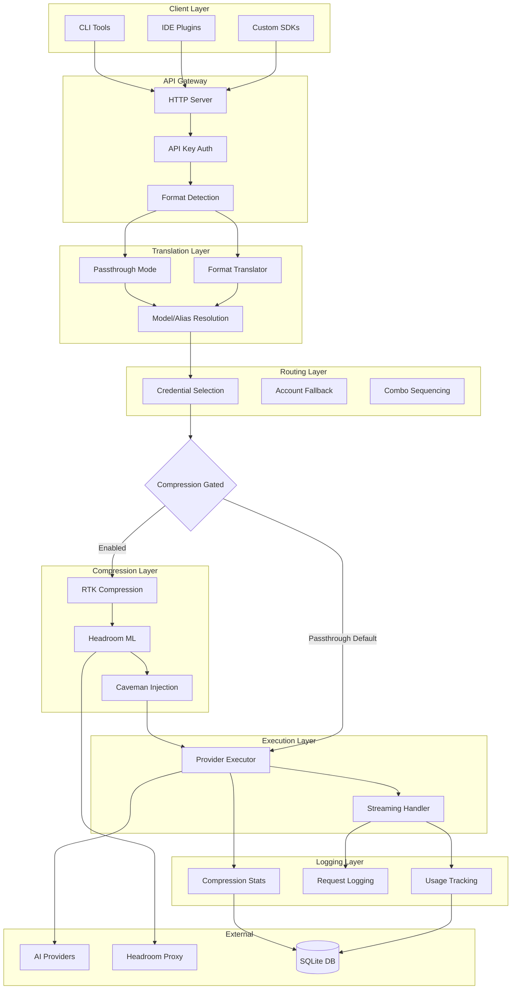
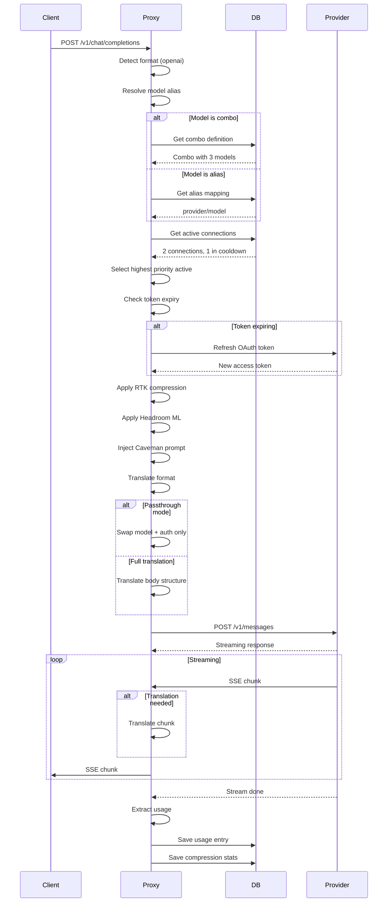
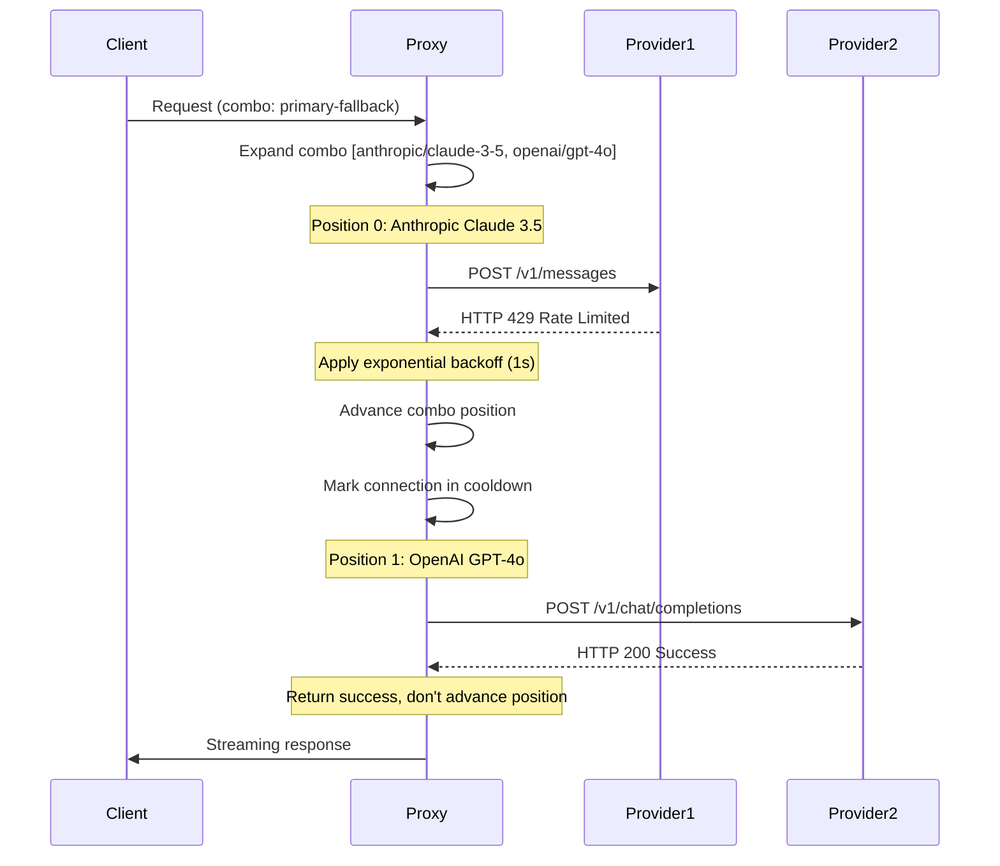
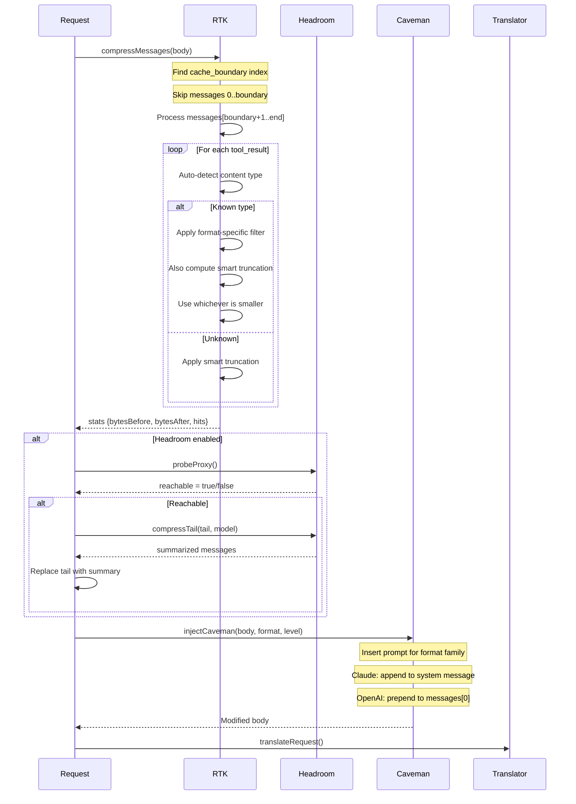

# AI Compression Routing Proxy - Design Document

## Overview

This design document specifies the architectural implementation for the AI Compression Routing Proxy feature, a local AI gateway that intermediates between developer clients and upstream AI provider APIs. The proxy handles multi-format request translation, intelligent routing with fallback capabilities, content compression via multiple strategies, and comprehensive request logging.

The system architecture follows a layered pipeline pattern with clear separation of concerns:

1. **Format Layer**: Request format detection and translation between provider ecosystems
2. **Model Layer**: Alias resolution and combo expansion for stable routing identifiers
3. **Routing Layer**: Credential selection, account fallback, and combo sequencing
4. **Compression Layer**: RTK tool-result compression, Headroom ML summarization, and Caveman prompt injection (gated by passthrough mode — disabled unless explicitly enabled)
5. **Execution Layer**: Provider-specific HTTP execution with streaming relay
6. **Reliability Layer**: Fail-closed for correctness/security, fail-open for optional side effects

**Core Design Principles:**

- **Fail closed for correctness and security**: Return an error instead of guessing when the system cannot determine correct behavior. Never return partial/malformed responses as success.
- **Fail open for optional side effects**: Statistics, logging, telemetry failures never break the request path.
- **Passthrough means passthrough**: Do not mutate provider-native requests unless a security, routing, or explicitly required compatibility rule says so.
- **Cache boundary is a hard correctness invariant**: Content at or before the cache boundary is immutable — violation silently corrupts the provider's KV prompt cache.

## Architecture

### Component Diagram



### System Context

The proxy operates as a local HTTP server that accepts OpenAI-compatible and Claude-compatible requests from client tools, then routes them to upstream providers with optional transformations. The system maintains state for credential cooldowns, combo positions, and compression statistics using SQLite storage.

**Key Integration Points:**

- **open-sse/**: Core translation and execution modules
- **cli/**: Server implementation and CLI entry points
- **Configuration**: Provider credentials via UI or config files
- **Logging**: Request and usage logs written to filesystem

## Components and Interfaces

### HTTP Server Interface

The proxy exposes a single HTTP endpoint that accepts requests in multiple formats and routes them appropriately.

```typescript
interface ProxyRequest {
  // HTTP headers
  authorization?: string;
  "content-type": string;
  accept: string;
  
  // Request body (OpenAI, Claude, Gemini, or custom format)
  body: OpenAIRequest | ClaudeRequest | GeminiRequest | CustomRequest;
  
  // Query parameters for combo expansion
  query?: {
    model?: string;
    combo?: string;
  };
}

interface ProxyResponse {
  status: number;
  headers: Record<string, string>;
  body: Stream | JSON;
}
```

### Format Detection Service

Format detection follows a priority order defined in `services/provider.js`:

1. **Header-based detection**: Check for `Anthropic-Version` header (Claude), `x-goog-api-key` header (Gemini)
2. **Body schema detection**: Examine request structure for format-specific fields
3. **Heuristic detection**: Analyze message content patterns and field presence

```javascript
// Format detection priority (from services/provider.js)
function detectFormat(body) {
  // OpenAI Responses API: has input array instead of messages
  if (body.input && (Array.isArray(body.input) || typeof body.input === "string")) {
    return "openai-responses";
  }
  
  // Antigravity format: Gemini wrapped in body.request
  if (body.request?.contents && body.userAgent === "antigravity") {
    return "antigravity";
  }
  
  // Gemini format: has contents array
  if (body.contents && Array.isArray(body.contents)) {
    return "gemini";
  }
  
  // OpenAI-specific fields check
  if (body.stream_options || body.response_format || body.logprobs !== undefined) {
    return "openai";
  }
  
  // Claude format detection
  if (body.messages && Array.isArray(body.messages)) {
    // Check for Claude-specific structure
    const hasClaudeContent = firstMsg.content.some(c => 
      c.type === "tool_use" || c.type === "tool_result"
    );
    if (hasClaudeContent) return "claude";
  }
  
  return "openai"; // Default
}
```

### Passthrough Mode

Passthrough mode skips format translation when the client tool and target provider belong to the same ecosystem. This preserves the original request structure — the proxy only swaps model names, injects auth headers, and applies transport-layer concerns. Passthrough is a first-class behavior and the proxy MUST NOT mutate provider-native request shapes unless a security, routing, or explicitly required compatibility rule demands it.

```javascript
// Passthrough conditions (from handlers/chatCore.js)
function isNativePassthrough(clientTool, provider) {
  // Claude CLI → Anthropic Claude
  if (clientTool === "claude" && provider === "claude") return true;
  
  // OpenAI SDK → OpenAI
  if (clientTool === "openai" && provider === "openai") return true;
  
  // Cursor → Cursor
  if (clientTool === "cursor" && provider === "cursor") return true;
  
  return false;
}
```

**Passthrough Preservation Rules (Req 16):**

- Preserve all provider-native fields in the request body without renaming or dropping unknown fields
- Preserve client-requested streaming behavior (do not force non-streaming if client requested streaming, and vice versa except where always-streaming providers require SSE assembly)
- Preserve upstream response shape, upstream error shape where safe, and provider-specific response fields
- Do NOT translate the request body into another provider schema unless explicitly required by the endpoint contract
- Do NOT alter tool definitions unless a known provider compatibility rule explicitly requires it to prevent upstream rejection

**Allowed Passthrough Mutations (always applied regardless of passthrough):**

- Authentication enforcement (API key validation)
- Provider/model resolution and model name substitution
- Connection selection and upstream auth header injection
- Outbound proxy routing and MITM bypass DNS rules
- Removal of local-only proxy metadata fields not recognized by the upstream provider
- Known compatibility fixes that prevent upstream rejection (e.g., stripping provider prefixes from Anthropic built-in tool `model` fields)
- Request/response logging if enabled (labeled as passthrough — see Logging section)

**Passthrough Compression Gating (Req 15):**

- Compression (RTK, Headroom, Caveman) is NOT applied to passthrough requests by default
- Compression is only applied when `passthroughCompression` is explicitly enabled in settings
- If passthrough compression is enabled and compression fails, continue with original unmodified content

**Passthrough Error Behavior (Reqs 17, 18):**

- If passthrough resolution fails, return an error — do NOT silently fall back to translated mode
- Do NOT guess the intended provider or mutate the request into a different provider format
- Passthrough must be predictable: either forward safely or fail clearly

```javascript
// Passthrough compression gating
function shouldCompressPassthrough(settings, isPassthrough) {
  if (!isPassthrough) return true; // Non-passthrough always eligible
  return settings.passthroughCompression === true; // Passthrough requires explicit opt-in
}
```

### Translator Interface

The translator uses a registry pattern with lazy-loaded format converters:

```javascript
// Translator registry pattern (from translator/index.js)
const requestRegistry = new Map();
const responseRegistry = new Map();

function translateRequest(sourceFormat, targetFormat, model, body, stream, credentials, provider) {
  let result = structuredClone(body);
  
  // Step 1: source → openai intermediate format
  if (sourceFormat !== FORMATS.OPENAI) {
    const toOpenAI = requestRegistry.get(`${sourceFormat}:${FORMATS.OPENAI}`);
    if (toOpenAI) result = toOpenAI(model, result, stream, credentials);
  }
  
  // Step 2: openai → target format
  if (targetFormat !== FORMATS.OPENAI) {
    const fromOpenAI = requestRegistry.get(`${FORMATS.OPENAI}:${targetFormat}`);
    if (fromOpenAI) result = fromOpenAI(model, result, stream, credentials);
  }
  
  return result;
}
```

### Model and Alias Resolution

Model strings can be in three formats:

```typescript
type ModelString = 
  | `${ProviderAlias}/${ModelName}`  // e.g., "cc/claude-opus-4-6"
  | string;                           // e.g., "opus" (alias lookup)

interface AliasResolution {
  provider: string;   // Resolved provider ID
  model: string;      // Resolved model name
  isAlias: boolean;   // Whether original was alias
  original: string;   // Original input string
}
```

**Alias Resolution Process:**

1. Parse model string using `parseModel()` from `services/model.js`
2. If format is `provider/model`, resolve provider alias to ID and return directly
3. If format is plain string, look up in alias registry
4. If no alias found, infer provider from model name prefix (e.g., `claude-` → anthropic)

### Credential Selection

Credential selection implements priority-based sticky round-robin:

```typescript
interface Connection {
  id: string;
  provider: string;
  providerSpecificData: {
    connectionProxyEnabled?: boolean;
    connectionProxyUrl?: string;
    connectionNoProxy?: string;
    vercelRelayUrl?: string;
  };
  rateLimitedUntil?: string;  // ISO timestamp
  backoffLevel: number;
}

interface CredentialSelectionResult {
  connection: Connection;
  priority: number;  // Selection priority
  isNew: boolean;    // First request on this connection
}
```

**Selection Algorithm:**

1. Filter connections by provider and exclude those in cooldown
2. Also exclude connections with invalid credentials (e.g. failed OAuth token refresh) — these are treated as unavailable even if not formally in cooldown
3. Sort by priority (lower = higher priority)
4. Apply round-robin with sticky limit (same connection for N consecutive requests)
5. If no active Connection with valid credentials exists (including zero configured connections or all have failed token refresh), return HTTP 404 with "No active credentials for provider: {provider}"
6. If all Connections are in Cooldown (but credentials are otherwise valid), wait until earliest Cooldown reset time and retry; enforce a **minimum retry delay of 1 second** regardless of calculated Cooldown reset times. Then return HTTP 503 with Retry-After header if retry also fails.

### Account Fallback

Account fallback implements exponential backoff for rate limits:

```typescript
interface FallbackResult {
  shouldFallback: boolean;
  cooldownMs: number;
  newBackoffLevel?: number;
}

// Minimum retry delay when all cooldowns resolve to 0
const MIN_RETRY_DELAY_MS = 1000;  // Enforced even when all Cooldown reset times are 0

// Fallback rules (from config/errorConfig.js)
const ERROR_RULES = [
  // Text-based rules (checked first, order = priority)
  { text: "rate limit", backoff: true },
  { text: "too many requests", backoff: true },
  { text: "quota exceeded", backoff: true },
  
  // Status-based rules
  { status: 429, backoff: true },  // Exponential backoff
  { status: 500, cooldownMs: 30000 },  // Transient cooldown
  { status: 502, cooldownMs: 30000 },
  { status: 503, cooldownMs: 30000 },
  { status: 504, cooldownMs: 30000 },
];
```

**Backoff Calculation:**

```javascript
function getQuotaCooldown(backoffLevel = 0) {
  const level = Math.max(0, backoffLevel - 1);
  const cooldown = BACKOFF_CONFIG.base * Math.pow(2, level);
  return Math.min(cooldown, BACKOFF_CONFIG.max);  // Max 5 minutes
}
```

**Backoff Reset Rule:** Backoff level is reset **only on HTTP 2xx responses**. Non-2xx responses that do not trigger cooldown (e.g. 4xx client errors) do not reset the backoff counter. This is intentional: a 4xx indicates the request was invalid, not that the connection has recovered.

**Retry Limit:** The Proxy retries at most N times per request, where N equals the number of configured Connections for the provider. If a provider has zero configured Connections, the Proxy performs zero retries and immediately returns HTTP 404.

**Zero Connections:** If a provider has zero configured Connections, the Proxy SHALL immediately return HTTP 404 with "No active credentials for provider: {provider}" without attempting dispatch or any retries.

### Combo Fallback Sequencing

Combos are ordered lists of provider/model strings:

```typescript
interface Combo {
  name: string;
  models: string[];  // Ordered list of provider/model strings
}

interface ComboState {
  combo: Combo;
  currentIndex: number;  // Current position in combo list
  exhausted: Set<number>;  // Indices that have failed
}
```

**Combo Sequencing Rules:**

- **4xx responses** (excluding 429): Return immediately to client, do NOT advance combo position (client error — not the provider's fault)
- **429 responses**: Advance position, apply account cooldown to failed connection
- **5xx responses**: Advance position, apply transient cooldown to failed connection
- **200 responses**: Return immediately, do not advance combo position
- **All exhausted**: Return HTTP 503 with last error message
- **⚠ Non-combo requests**: Combo position advancement logic applies **only when the request explicitly targets a Combo**. For plain provider/model requests, no combo state is read or modified.
- **Zero connections**: If a provider in the combo has zero configured connections, immediately fail that combo entry and advance to the next without attempting dispatch

### Streaming Response Handling

```typescript
interface StreamingConfig {
  requested: boolean;       // Client requested streaming
  providerRequires: boolean; // Provider always streams (OpenAI, Codex)
  clientPrefersJson: boolean; // Accept header preference
}

function determineStreamMode(config) {
  // Provider always streams but client didn't request → collect and assemble
  // Assembled response is returned with Content-Type: application/json
  // If assembly fails partway through (malformed/incomplete data), discard ALL partial data and return error
  // Partial JSON MUST NEVER be returned to non-streaming clients — this is a hard safety invariant
  if (config.providerRequires && !config.requested) {
    return "assemble";  // Response MUST set Content-Type: application/json
  }
  
  // Client prefers JSON via Accept header → non-streaming
  if (config.clientPrefersJson && !config.requested) {
    return "json";
  }
  
  // Default to client preference
  return config.requested ? "stream" : "json";
}
```

**Passthrough Streaming Preservation (Req 16.2):**
- In passthrough mode, preserve the client's requested streaming behavior
- Do NOT force non-streaming if the client requested streaming
- Do NOT force streaming if the client requested non-streaming, except for always-streaming providers where SSE assembly is needed to fulfill the client contract
- If assembly fails, discard all partial data and return an error — never return partial JSON as success

## Data Models

### ProxyRequest

The main request structure accepted by the proxy:

```typescript
interface ProxyRequest {
  // Request identification
  id: string;
  timestamp: string;
  
  // Client information
  userAgent?: string;
  clientIp?: string;
  
  // Format information
  sourceFormat: Format;
  targetFormat: Format;
  clientTool?: string;
  
  // Model resolution
  originalModel: string;
  resolvedProvider: string;
  resolvedModel: string;
  combo?: string;
  
  // Credentials
  connection?: Connection;
  
  // Request body
  body: Record<string, unknown>;
  
  // Streaming configuration
  stream: boolean;
  
  // Compression settings
  rtkEnabled: boolean;
  cavemanEnabled: boolean;
  cavemanLevel?: number;
  headroomEnabled: boolean;
  passthroughCompression: boolean; // Explicit opt-in for compression in passthrough mode
  
  // Passthrough state
  isPassthrough: boolean;
  
  // Logging
  requestLogger?: RequestLogger;
}
```

### Connection

Provider credential record stored in the database:

```typescript
interface Connection {
  id: string;
  provider: string;
  connectionName?: string;
  
  // Credential data
  apiKey?: string;
  accessToken?: string;
  refreshToken?: string;
  expiresAt?: string;
  providerSpecificData?: {
    baseUrl?: string;
    region?: string;
    
    // Per-connection outbound proxy
    connectionProxyEnabled?: boolean;
    connectionProxyUrl?: string;
    connectionNoProxy?: string;
    vercelRelayUrl?: string;
  };
  
  // Rate limiting state
  rateLimitedUntil?: string;  // ISO timestamp
  backoffLevel: number;
  lastError?: {
    status: number;
    message: string;
    timestamp: string;
  };
  
  // Status tracking
  status: "active" | "error" | "disabled";
  createdAt: string;
  lastUsedAt?: string;
}
```

### Combo

Named fallback sequence definition:

```typescript
interface Combo {
  id: string;
  name: string;              // e.g., "primary-fallback"
  description?: string;
  models: string[];          // Ordered provider/model strings
  stickyLimit?: number;      // Round-robin sticky limit per model
  enabled: boolean;
}
```

### CompressionStats

Statistics record for compression subsystem tracking:

```typescript
interface CompressionStats {
  id?: number;              // SQLite auto-increment
  timestamp: string;        // ISO8601
  subsystem: "rtk" | "headroom" | "caveman";
  bytesBefore: number;
  bytesAfter: number;
  filterHits?: string;      // JSON array of filter names
  level?: string;           // Caveman intensity level
  detail?: string;          // Additional details
}
```

**Recording Rules:**
- A stats record is written only when the subsystem **actually ran and produced output** — i.e. compression or injection occurred. A subsystem that is enabled in settings but produced no change (e.g. Caveman configured but no injection happened because no eligible injection point exists, RTK found nothing to compress) does NOT write a record.
- This applies to all three subsystems: RTK, Headroom, and Caveman.
- If writing the stats record fails, log the failure and continue — the request is NOT interrupted (Req 9.6, 14.3).
- If logging the stats failure itself fails, still continue unconditionally — no further logging attempts (Req 14.4).

### UsageEntry

Request usage record for cost tracking:

```typescript
interface UsageEntry {
  id?: number;
  timestamp: string;
  provider: string;
  model: string;
  connectionId?: string;
  promptTokens: number;
  completionTokens: number;
  cacheReadTokens?: number;
  cacheCreationTokens?: number;
  reasoningTokens?: number;
  estimated: boolean;
}
```

## API Specifications

### Proxy Endpoint

**POST /v1/chat/completions**

```
Content-Type: application/json
Accept: text/event-stream | application/json
Authorization: Bearer <api-key>
```

**Request Body:**

```json
{
  "model": "opus",  // Can be alias or combo name
  "messages": [
    { "role": "user", "content": "Hello" }
  ],
  "stream": true,
  "tools": [...],
  "cache_control": {...}
}
```

**Response (Streaming):**

```
HTTP/1.1 200 OK
Content-Type: text/event-stream

data: {"id":"...","object":"chat.completion.chunk",...}
data: {"id":"...","object":"chat.completion.chunk",...}
...
data: [DONE]
```

**Response (Non-streaming):**

```json
HTTP/1.1 200 OK
Content-Type: application/json

{
  "id": "...",
  "object": "chat.completion",
  "created": 1234567890,
  "model": "opus",
  "choices": [...],
  "usage": {...}
}
```

### Statistics Endpoints

**GET /stats/compression**

```json
{
  "rtk": {
    "totalRequests": 1500,
    "totalBytesBefore": 1024000,
    "totalBytesAfter": 512000,
    "averageCompressionRatio": 0.5
  },
  "headroom": {...},
  "caveman": {...}
}
```

**GET /stats/usage**

```json
{
  "totalRequests": 5000,
  "byProvider": {
    "claude": 2000,
    "openai": 1500,
    "gemini": 1000
  },
  "totalTokens": {
    "prompt": 15000000,
    "completion": 5000000
  }
}
```

### Health Endpoint

**GET /health**

```json
{
  "status": "healthy",
  "components": {
    "database": "healthy",
    "headroom": "reachable",
    "connections": "5 active"
  }
}
```

## Request Processing Pipeline

### Flowchart

```mermaid
flowchart TD
    A[HTTP Request] --> B{Bearer token present?}
    B -->|Yes| C{Valid token?}
    C -->|No| E[401 Unauthorized]
    C -->|Yes| D
    B -->|No| B2{requireApiKey?}
    B2 -->|Yes| E
    B2 -->|No| D[Accept - log bypass]
    D[Parse Request] --> F{Format Detected?}
    F -->|No| G[400 Bad Request]
    F -->|Yes| H[Resolve Model/Alias]
    H --> I{Resolved to Combo?}
    I -->|Yes| J[Expand Combo]
    I -->|No| K[Get Provider/Model]
    J --> L[Select Credential]
    K --> L
    L --> M{Found Active Connection?}
    M -->|No - zero configured| N2[404 No credentials - zero retries]
    M -->|No - all in cooldown| N[Wait min 1s then 503]
    M -->|Yes| O{Token Expiring Soon?}
    O -->|Yes| P[Refresh OAuth Token]
    P --> Q
    O -->|No| Q{Passthrough?}
    Q -->|Yes| QA{Passthrough Compression Enabled?}
    QA -->|No| AB2[Skip Compression - Forward Original]
    QA -->|Yes| R2{RTK Enabled?}
    Q -->|No| R2
    R2 -->|Yes| S[Compress Tool Results]
    S --> T
    R2 -->|No| T{Headroom Enabled?}
    T -->|Yes| U[Probe Headroom Health]
    U --> V{Headroom Reachable?}
    V -->|Yes| W[ML Summarize Tail]
    V -->|No| X[Skip Headroom]
    W --> Y
    X --> Y[Caveman Injection]
    Y --> Z{Caveman Enabled?}
    Z -->|Yes| AA[Inject Terse Prompt]
    AA --> AB
    Z -->|No| AB[Translate Format]
    AB --> AC{Is Passthrough?}
    AC -->|Yes| AD[Swap Model + Auth Only]
    AC -->|No| AE[Translate Request Body]
    AD --> AF
    AE --> AF[Execute Request]
    AB2 --> AD2[Apply Passthrough Mutations Only]
    AD2 --> AF
    AF --> AG{Provider Response OK?}
    AG -->|No| AH{Should Fallback?}
    AH -->|Yes| AI[Apply Cooldown]
    AI --> AJ[Retry with Next Credential]
    AJ --> L
    AH -->|No| AK[Return Error Response]
    AG -->|Yes| AL{Streaming?}
    AL -->|Yes| AM[Relay SSE Stream]
    AM --> AN{Translate Response?}
    AN -->|Yes| AO[Translate Chunks]
    AO --> AP[Send to Client]
    AN -->|No| AP
    AL -->|No| AQ[Assemble Full Response]
    AQ --> AR[Translate JSON]
    AR --> AS[Send JSON to Client]
```



### Step Details

**1. Authentication:**
- Check `requireApiKey` setting
- If `requireApiKey` is enabled: validate the API key against the local store; reject absent or invalid keys with HTTP 401; no bypass mechanism is allowed — all requests MUST present a valid active API key regardless of any other configuration
- If `requireApiKey` is disabled: accept requests without a key AND log that authentication was bypassed — but if an `Authorization: Bearer` header IS present, validate it anyway; an invalid or expired key is ALWAYS rejected with HTTP 401 regardless of the enforcement mode. The no-auth bypass only applies when NO Authorization header is present at all. An explicit but invalid credential is ALWAYS rejected.
- Log authentication status (timestamp, request path, authenticated status, key ID if authenticated)

**2. Format Detection:**
- Check request headers for format indicators
- Analyze request body schema
- Apply heuristic rules

**3. Model Resolution:**
- Parse model string (alias vs. provider/model)
- Look up alias in registry
- Expand combo if applicable

**4. Credential Selection:**
- Filter active connections for provider
- Apply priority ordering
- Enforce sticky round-robin limit
- Check token expiry, refresh if needed

**5. Compression Pipeline:**
- **Passthrough Gating (Req 15)**: If the request is passthrough AND `passthroughCompression` is NOT explicitly enabled in settings, skip the entire compression pipeline — forward the original request body unmodified. Do NOT alter provider-native message arrays in passthrough mode unless compression is explicitly enabled and configured. If passthrough compression IS enabled and compression fails, continue with the original unmodified content.
- **RTK**: Compress tool results, skip cache boundary content (**hard correctness invariant** — cache boundary content is immutable; verify boundary integrity post-compression); record stats only when compression actually occurred. When a named filter produces output equal to or larger than the input, attempt smart truncation as a secondary fallback. Additionally, when a named filter is selected but smart truncation would produce smaller output, use smart truncation instead of the named filter. If smart truncation also produces output ≥ input, retain original unmodified content.
- **Headroom**: Probe health (with hard skip conditions: skip when tail is empty OR consists entirely of system messages — do NOT probe the Headroom service in either case), summarize conversation tail via ML (**cache boundary content MUST NOT be included in any summarization payload**); record stats only when summarization was applied
- **Caveman**: Inject terse prompt at appropriate position; record stats only when injection actually occurred — do NOT record when Caveman is enabled but the request body had no eligible injection point. Proceed unconditionally even if stats recording fails. If logging the stats failure itself fails, still proceed unconditionally.

**5a. Reliability Principle (Req 17):**
- The main request path continues unless continuing would violate: security, authentication correctness, request validity, response validity, DNS/MITM bypass integrity, or model/provider resolution correctness.
- Optional subsystems (compression statistics, Caveman statistics, request logs, debug logs, telemetry, non-critical metadata recording) MUST NOT break the request path.
- If an optional subsystem fails: log the failure if possible and continue. If logging the failure also fails: continue without further logging attempts.
- Translation rules do NOT automatically apply to passthrough mode — passthrough avoids translation unless explicitly required by the selected endpoint contract or configuration.

**6. Translation:**
- Check passthrough conditions (same ecosystem)
- Translate request body if needed
- Handle tool name mapping (e.g., Claude cloaking)
- **Passthrough preservation (Req 16)**: In passthrough mode, preserve all provider-native fields without renaming or dropping. Only remove local-only proxy metadata fields. Apply known compatibility fixes (e.g. Anthropic built-in tool model prefix stripping) that prevent upstream rejection. Do NOT alter tool definitions unless a known provider compatibility rule explicitly requires it.
- **Correctness (Req 18)**: If translation cannot produce a valid upstream body, return HTTP 400. If post-translation validation fails, return HTTP 400. Use preferred error types: `translation_invalid_body`, `validation_failed`, `unsupported_request`, `missing_required_field`.

**7. Execution:**
- Send request via provider executor
- Handle streaming vs. non-streaming
- Manage upstream connection lifecycle

**8. Response Handling:**
- Translate response back to source format (skip for passthrough — preserve upstream response shape, error shape, and provider-specific fields)
- Relay or assemble based on streaming mode
- When assembling SSE into a full response (provider always streams but client did not request streaming), explicitly set `Content-Type: application/json` on the assembled response
- If assembly fails (malformed/incomplete SSE data), discard all partial data and return error; partial JSON is NEVER returned to non-streaming clients
- **Response Validity Guarantee (Req 18)**: NEVER return partial JSON as success, malformed JSON with `application/json`, incomplete SSE assembly as a normal response, a translated-but-invalid upstream body, a successful HTTP status for failed combo/model resolution, or a successful HTTP status for failed passthrough provider resolution. If the proxy cannot guarantee response validity, return an error.
- Log usage and request details
- **Passthrough logging (Req 12.9)**: Label passthrough log entries as passthrough, preserve enough raw request/response shape to debug provider compatibility, redact secrets, and do NOT make passthrough logs appear as translated requests
- **Failed/partial logging (Req 12.10)**: Clearly mark failed or incomplete log entries as such; partial logs MUST NOT appear as successful requests

## Integration Points

### open-sse/ Module Integration

The proxy leverages existing open-sse modules for core functionality:

```javascript
// Format detection and translation
import { detectFormat, getTargetFormat } from "./services/provider.js";
import { translateRequest, translateResponse } from "./translator/index.js";

// Credential and account management
import { checkFallbackError, isAccountUnavailable } from "./services/accountFallback.js";
import { parseModel, resolveModelAliasFromMap } from "./services/model.js";

// Compression subsystems
import { compressMessages, findLastCacheBoundary } from "./rtk/index.js";
import { compressWithHeadroom } from "./rtk/headroom.js";
import { injectCaveman } from "./rtk/caveman.js";

// Request handling
import { handleChatCore } from "./handlers/chatCore.js";

// Provider executors
import { getExecutor } from "./executors/index.js";

// Logging and tracking
import { createRequestLogger } from "./utils/requestLogger.js";
import { logUsage, extractUsage } from "./utils/usageTracking.js";
```

### CLI Integration

The CLI server uses the open-sse module for proxy operations:

```javascript
// From cli/app/server.js
import { handleChatCore } from "open-sse/handlers/chatCore.js";

async function handleRequest(req, res) {
  const body = await req.json();
  const result = await handleChatCore({
    body,
    modelInfo: { provider, model },
    credentials: connection,
    log: logger,
    rtkEnabled: settings.rtkEnabled,
    cavemanEnabled: settings.cavemanEnabled,
    cavemanLevel: settings.cavemanLevel,
    headroomEnabled: settings.headroomEnabled,
  });
  
  // Send response
  res.status(result.status).send(result.body);
}
```

### Database Integration

SQLite stores for persistence:

```javascript
// Compression statistics
import { saveCompressionStats } from "./lib/compressionStats.js";

// Usage tracking
import { saveRequestUsage, appendRequestLog } from "./lib/usageDb.js";
```

### External Service Integration

**Headroom ML Proxy:**

**Headroom Skip Conditions (hard skips — checked BEFORE probing the proxy):**

Skip Headroom compression — regardless of potential byte savings — when either of these is true:
- Content after the Cache_Boundary is **empty** (no messages remain to compress)
- Content after the Cache_Boundary consists **entirely of system-role messages**

These are hard skips. The proxy does NOT contact the Headroom service in either case. No health probe, no summarization request.

```javascript
// Probes health endpoint every 30 seconds
const PROBE_TTL_MS = 30_000;
async function probeProxy() {
  const res = await fetch(`${baseUrl}/health`, { signal: timeout(1500) });
  return res.ok;
}

// Compresses conversation tail
async function compressWithHeadroom(body, model) {
  const compress = await loadCompress();
  if (!compress) return null;
  
  // Hard skip: no compressible content after cache boundary
  const tail = messagesAfterCacheBoundary(body);
  if (tail.length === 0) return null;
  
  // Hard skip: tail contains only system messages (regardless of byte savings)
  if (tail.every(m => m.role === "system")) return null;
  
  // Only probe AFTER passing skip conditions
  if (!(await probeProxy())) return null;
  
  return compress(body.messages, { model });
}
```

**Provider APIs:**
- HTTP requests via `proxyAwareFetch` with proxy support
- Supports MITM DNS bypass for specific hosts — **but only when no outbound proxy is configured for the connection**. When an outbound proxy is configured, the proxy performs DNS resolution; direct DNS bypass is skipped entirely. If external DNS fails for bypass hosts, the request fails — **never** falls back to system DNS.
- Per-connection proxy routing (explicit precedence order: per-connection proxy > environment variables > Vercel relay)
- Vercel relay headers for special routing

## Sequence Diagrams

### Request Routing Sequence



### Combo Fallback Sequence



### Compression Pipeline Sequence



## Correctness Properties

*A property is a characteristic or behavior that should hold true across all valid executions of a system—essentially, a formal statement about what the system should do. Properties serve as the bridge between human-readable specifications and machine-verifiable correctness guarantees.*

### Property 1: Request Format Translation Round-Trip

*For any* request body with detected source format and valid target provider, translating from source format to target format and back to source format SHALL produce a semantically equivalent request body

**Validates: Requirements 1.1, 1.3, 1.5**

### Property 2: Cache Boundary Preservation

*For any* request body containing cache_control markers, RTK and Headroom compression SHALL NOT modify any message at or before the last cache_control boundary index. This is a **hard correctness invariant** — violation silently corrupts the provider's KV prompt cache. Messages at or before the boundary MUST be byte-for-byte unchanged after any compression pass. If a compression subsystem detects post-compression that boundary content has been mutated, it MUST abort and log a critical error.

**Validates: Requirements 7.3, 8.2**

### Property 3: Credential Selection Excludes Cooldowns

*For any* provider with multiple connections, the credential selector SHALL only return connections that are not currently in cooldown (rateLimitedUntil is null or in the past) and that have valid credentials; when no valid-credential connections exist (including zero configured), return HTTP 404

**Validates: Requirements 3.1, 3.3, 4.8**

### Property 4: Combo Advancement Only On Retriable Errors

*For any* combo request, the combo sequencer SHALL advance to the next model only when the current model returns HTTP 429 or 5xx; SHALL NOT advance on 4xx (returning the error to the client instead); and SHALL NOT read or modify combo state for non-combo requests regardless of response status

**Validates: Requirements 5.1, 5.2, 5.3, 5.4, 5.5**

### Property 5: Backoff Exponential Growth

*For any* connection receiving consecutive 429 responses, the cooldown duration SHALL follow exponential growth: level N cooldown = base * 2^(N-1), capped at max value

**Validates: Requirements 4.1**

### Property 6: Passthrough Skips Translation

*For any* request where client tool identity matches target provider ecosystem, passthrough mode SHALL be applied and format translation SHALL NOT be invoked

**Validates: Requirements 1.2**

### Property 7: Compression Statistics Conditional Recording

*For any* request where a compression subsystem (RTK, Headroom, Caveman) is enabled, a corresponding statistics record SHALL be persisted if and only if compression or injection actually occurred. A subsystem that is configured but produces no output (e.g. Caveman enabled but no eligible injection point, RTK found nothing to compress) SHALL NOT write a statistics record. If writing the stats record fails, the request proceeds unconditionally; if logging that failure itself fails, still proceed.

**Validates: Requirements 7.12, 9.5, 9.6, 14.1, 14.3, 14.4**

### Property 8: Usage Tracking on Completion

*For any* completed request (HTTP 200), a usage entry SHALL be recorded with the provider, model, and token counts from the upstream response

**Validates: Requirements 12.1**

### Property 9: Invalid Bearer Token Always Rejected

*For any* request that includes an `Authorization: Bearer` header with an invalid or expired API key, the proxy SHALL return HTTP 401 regardless of whether `requireApiKey` is enabled or disabled; the no-auth bypass only applies when NO Authorization header is present at all

**Validates: Requirements 13.7**

### Property 10: SSE Assembly Discards All Partial Data on Failure

*For any* malformed or incomplete SSE stream being assembled for a non-streaming client, the proxy SHALL discard ALL partially assembled data and return an error response; partial JSON SHALL NEVER be returned to non-streaming clients

**Validates: Requirements 6.6**

### Property 11: Cooldown Minimum Retry Delay

*For any* set of connections where all are in cooldown, the proxy SHALL enforce a minimum retry delay of 1 second regardless of calculated cooldown reset times (even when all reset times resolve to 0)

**Validates: Requirements 3.4**

### Property 12: RTK Smart Truncation Secondary Fallback

*For any* tool result blob where a named filter is selected, if smart truncation would produce smaller output than the named filter, the RTK SHALL use smart truncation instead; if the named filter produces output ≥ input size, smart truncation SHALL be attempted as secondary fallback

**Validates: Requirements 7.9, 7.10**

### Property 13: Headroom Hard Skip Before Probing

*For any* request where content after the Cache_Boundary is empty OR consists entirely of system messages, the proxy SHALL skip Headroom compression without contacting the Headroom service (no health probe, no summarization request)

**Validates: Requirements 8.3**

### Property 14: DNS Bypass Never Falls Back to System DNS

*For any* request targeting a host in the MITM bypass list where no outbound proxy is configured, if external DNS resolution fails, the request SHALL fail; the proxy SHALL NEVER fall back to system DNS for bypass hosts

**Validates: Requirements 11.4**

### Property 15: Outbound Proxy Precedence

*For any* connection configuration with multiple proxy sources available, the proxy SHALL apply outbound proxy precedence strictly in the order: per-connection proxy (highest) > environment variables (HTTP_PROXY/HTTPS_PROXY/ALL_PROXY) > Vercel relay (lowest)

**Validates: Requirements 10.1**

### Property 16: Passthrough Compression Gating

*For any* passthrough mode request, the proxy SHALL NOT invoke any compression subsystem (RTK, Headroom, or Caveman) unless `passthroughCompression` is explicitly enabled in settings. When passthrough compression is disabled, the original request body SHALL be forwarded unmodified — provider-native message arrays MUST NOT be altered.

**Validates: Requirements 15.1, 15.2, 15.3**

### Property 17: Passthrough Field Preservation

*For any* passthrough mode request body containing arbitrary provider-native fields, the proxy SHALL preserve all fields without renaming or dropping unknown fields, SHALL remove only local-only proxy metadata fields not recognized by the upstream provider, and SHALL NOT alter tool definitions unless a known provider compatibility rule explicitly requires it to prevent upstream rejection.

**Validates: Requirements 16.1, 16.6, 16.7**

### Property 18: Passthrough Response Preservation

*For any* passthrough mode response from the upstream provider, the proxy SHALL preserve the upstream response shape, upstream error shape (where safe), and provider-specific response fields without translation into another provider schema unless the endpoint contract explicitly requires it.

**Validates: Requirements 16.3**

### Property 19: Optional Subsystem Failure Isolation

*For any* request where an optional subsystem (compression statistics, Caveman statistics, request logs, debug logs, telemetry, non-critical metadata recording) fails during processing, the main request path SHALL continue to completion. If logging the optional subsystem failure also fails, the request SHALL still continue without further logging attempts.

**Validates: Requirements 17.1, 17.2, 17.3**

### Property 20: Resolution Failure Is Fail-Closed

*For any* request where model resolution, combo resolution, or passthrough provider resolution ultimately fails, the proxy SHALL return an error AND SHALL NOT silently fall back to an alternative resolution path, guess the intended provider, or mutate the request into a different provider format. A combo name match alone is NOT sufficient — resolution succeeds only when it resolves to a valid actionable provider/model target.

**Validates: Requirements 17.5, 17.6, 18.1, 18.2, 18.9**

### Property 21: Translation/Validation Failure Returns 400

*For any* request where format translation cannot produce a valid upstream body OR post-translation validation fails, the proxy SHALL return HTTP 400 with a descriptive error. This applies to all request-shape failures that prevent successful processing.

**Validates: Requirements 18.3, 18.4, 18.7**

### Property 22: Response Validity Guarantee

*For any* response the proxy returns to a client, the proxy SHALL NEVER return: partial JSON as success, malformed JSON with `application/json` Content-Type, incomplete SSE assembly as a normal response, a translated-but-invalid upstream body, a successful HTTP status for failed combo/model resolution, or a successful HTTP status for failed passthrough provider resolution. If the proxy cannot guarantee response validity, it SHALL return an error rather than a potentially invalid response.

**Validates: Requirements 18.10, 18.11**

### Property 23: Passthrough Logs Labeled Separately

*For any* passthrough request that is logged (when `ENABLE_REQUEST_LOGS` is enabled), the log entry SHALL be labeled as passthrough, SHALL preserve enough raw request/response shape to debug provider compatibility, SHALL redact secrets, and SHALL NOT appear as a translated request log entry.

**Validates: Requirements 12.9**

### Property 24: Failed/Partial Logs Clearly Marked

*For any* request that fails or partially completes while logging is enabled, the log entry SHALL be clearly marked as failed or incomplete; partial logs MUST NOT appear as successful requests.

**Validates: Requirements 12.10**

## Error Handling

### Error Classification

Errors are classified by HTTP status code and mapped to client-facing error types:

```javascript
const ERROR_TYPES = {
  400: { type: "invalid_request_error", code: "bad_request" },
  401: { type: "authentication_error", code: "invalid_api_key" },
  403: { type: "permission_error", code: "insufficient_quota" },
  404: { type: "invalid_request_error", code: "model_not_found" },
  429: { type: "rate_limit_error", code: "rate_limit_exceeded" },
  500: { type: "server_error", code: "internal_server_error" },
  502: { type: "server_error", code: "bad_gateway" },
  503: { type: "server_error", code: "service_unavailable" },
  504: { type: "server_error", code: "gateway_timeout" }
};
```

### Fallback Decision Matrix

| Upstream Status | Fallback Action | Cooldown | Combo Advance |
|----------------|-----------------|----------|---------------|
| 200 | Return response, reset backoff | None | No |
| 400-404 (excl 429) | Return error to client | None | No |
| 401/403 + token refresh fails | Retry with next connection | Long | No |
| 429 | Switch connection | Exponential | Yes (combo only) |
| 500-504 | Switch connection | Transient (30s) | Yes (combo only) |
| Zero connections configured | Immediate HTTP 404 — zero retries | None | N/A |
| All connections have invalid credentials | HTTP 404 "No active credentials for provider: {provider}" | None | N/A |
| All connections in cooldown | Wait (min 1s), retry, then HTTP 503 with Retry-After | None | N/A |

### Error Response Format

```json
{
  "error": {
    "type": "rate_limit_error",
    "code": "rate_limit_exceeded",
    "message": "Rate limit exceeded. retry after 30s",
    "status": 429
  }
}
```

### Retry-After Header

For 503 responses due to all connections in cooldown:

```
HTTP/1.1 503 Service Unavailable
Retry-After: 30
Content-Type: application/json
```

### Correctness Fail-Closed Rules (Req 18)

The proxy returns an error instead of guessing in these scenarios:

| Failure Condition | Response | Error Type |
|-------------------|----------|------------|
| Model/combo resolution ultimately fails | HTTP 400 | `invalid_request_error` |
| Passthrough provider resolution fails | HTTP 400 | `invalid_request_error` |
| Translation cannot produce valid body | HTTP 400 | `translation_invalid_body` |
| Post-translation validation fails | HTTP 400 | `validation_failed` |
| SSE assembly fails (non-streaming client) | HTTP 500 | `server_error` |
| MITM bypass DNS integrity unguaranteed | HTTP 502 | `dns_bypass_failed` |
| Any request-shape failure | HTTP 400 | `invalid_request_error` |

**Exhaustive "never return" list** — the proxy SHALL NEVER return:
- Partial JSON as success
- Malformed JSON with `application/json` Content-Type
- Incomplete SSE assembly as a normal response
- Translated-but-invalid upstream body
- Successful HTTP status for failed combo/model resolution
- Successful HTTP status for failed passthrough provider resolution

If validity cannot be guaranteed, the proxy returns an error.

### Reliability Rules (Req 17)

**Fail closed for:**
- Security and authentication correctness
- Request validity and response validity
- DNS/MITM bypass integrity
- Model/provider resolution correctness

**Fail open for (optional subsystems):**
- Compression statistics recording
- Caveman statistics recording
- Request logs and debug logs
- Telemetry and non-critical metadata recording

If an optional subsystem fails → log if possible → continue. If logging also fails → still continue.

### Passthrough Error Rules (Reqs 17, 18)

| Passthrough Failure | Behavior |
|---------------------|----------|
| Provider resolution fails | Return error, do NOT fall back to translated mode |
| Provider cannot be determined | Return error, do NOT guess |
| Compression enabled + fails | Continue with original unmodified content |
| Request body invalid | Return HTTP 400 |

## Testing Strategy

### Unit Tests

Unit tests verify specific examples and edge cases:

- Format detection for each format type (OpenAI, Claude, Gemini, Antigravity, OpenAI-Responses)
- Model alias resolution edge cases (missing alias, ambiguous prefix, combo vs alias)
- Credential selection with various cooldown states (none, partial, all)
- Credential selection when all connections have invalid credentials → HTTP 404
- Zero configured connections → immediate HTTP 404, zero retries, no dispatch attempt
- Combo sequencing with mixed success/failure responses (200, 4xx, 429, 5xx)
- Combo: 4xx returns error to client without advancing position
- Combo advancement applies only to combo requests, not plain provider/model requests
- Non-combo requests never read or modify combo state
- RTK filter behavior for each content type (git diff, grep, file tree, log, smart truncation)
- RTK: named filter producing output ≥ input falls back to smart truncation
- RTK: smart truncation used instead of named filter when it produces smaller output
- Caveman prompt injection for each format family (OpenAI-compatible, Claude-compatible)
- Caveman: stats not recorded when injection does not occur (no eligible injection point)
- Caveman: request proceeds unconditionally even if stats recording fails
- Caveman: request proceeds even if logging the stats failure itself fails
- Backoff reset only on 2xx; no reset on 4xx or unattempted paths
- Auth: invalid/expired Bearer token rejected with 401 even when `requireApiKey` is disabled
- Auth: no-auth bypass only when Authorization header is completely absent
- Auth: when `requireApiKey` is enabled, no bypass mechanism allowed — all requests require valid key
- SSE assembly sets `Content-Type: application/json`
- SSE assembly failure: malformed data causes discard of ALL partial buffer and error return; partial JSON never returned
- Headroom skip: empty tail → hard skip without probing service
- Headroom skip: system-only tail → hard skip without probing service
- DNS bypass: never falls back to system DNS for bypass hosts — request fails if external DNS fails
- DNS bypass: skipped entirely when outbound proxy is configured
- Proxy precedence: per-connection > env vars > Vercel relay (explicit order)
- Cooldown wait: minimum 1-second retry delay enforced even when all reset times are 0
- Request logging: partial results written when request fails after partial completion
- Stats recording: only when compression actually applied, not just when subsystem is enabled
- **Passthrough compression gating (Req 15)**: passthrough requests NOT compressed when `passthroughCompression` is disabled
- **Passthrough compression gating (Req 15)**: passthrough requests ARE compressed when `passthroughCompression` is explicitly enabled
- **Passthrough compression failure (Req 15)**: passthrough with compression enabled + compression fails → continues with original unmodified content
- **Passthrough field preservation (Req 16)**: unknown provider-native fields preserved in passthrough mode
- **Passthrough field preservation (Req 16)**: local-only proxy metadata fields removed in passthrough mode
- **Passthrough tool preservation (Req 16)**: tool definitions not altered in passthrough unless Anthropic prefix rule applies
- **Passthrough compatibility fix (Req 16)**: Anthropic built-in tool `model` prefix stripping still applied in passthrough
- **Passthrough streaming preservation (Req 16)**: client streaming preference preserved in passthrough mode
- **Passthrough response preservation (Req 16)**: upstream response shape, error shape, and provider-specific fields preserved
- **Passthrough no-translation (Req 16)**: request body NOT translated into another schema in passthrough mode
- **Fail-closed resolution (Req 17/18)**: passthrough resolution failure returns error, not silent fallback to translated mode
- **Fail-closed resolution (Req 18)**: model resolution failure returns error, not silent fallback
- **Fail-closed resolution (Req 18)**: combo name match alone does NOT count as successful resolution if inner resolution fails
- **Fail-closed translation (Req 18)**: invalid translation output returns HTTP 400
- **Fail-closed translation (Req 18)**: post-translation validation failure returns HTTP 400
- **Response validity (Req 18)**: partial JSON never returned as success
- **Response validity (Req 18)**: malformed JSON never returned with `application/json` Content-Type
- **Response validity (Req 18)**: successful HTTP status never returned for failed resolution
- **Optional subsystem isolation (Req 17)**: compression stats failure does not break request path
- **Optional subsystem isolation (Req 17)**: request log failure does not break request path
- **Optional subsystem isolation (Req 17)**: double failure (subsystem + logging) still continues
- **Passthrough logging (Req 12.9)**: passthrough log entries labeled as passthrough, not as translated
- **Passthrough logging (Req 12.9)**: passthrough logs preserve raw request/response shape with secrets redacted
- **Failed/partial logging (Req 12.10)**: failed request log clearly marked as failed
- **Failed/partial logging (Req 12.10)**: partially completed request log marked as incomplete, not successful

### Property-Based Tests

Property-based tests verify universal properties across generated inputs. Each test runs a minimum of **100 iterations**. Tests are tagged with the property they validate.

**Library**: Use a property-based testing library appropriate for the target language (e.g. `fast-check` for TypeScript/JavaScript).

---

**Property 1: Request Format Translation Round-Trip**
*Feature: ai-compression-routing-proxy, Property 1: request body translating source→target→source produces semantically equivalent structure*

For any valid request body with detected source format and valid target provider, translating from source format to target format and back SHALL produce a semantically equivalent request body.

Generates: random message arrays, system prompts, tool definitions, model names.

---

**Property 2: Cache Boundary Preservation**
*Feature: ai-compression-routing-proxy, Property 2: RTK/Headroom never modify messages at or before cache boundary (HARD CORRECTNESS INVARIANT)*

For any request body containing cache_control markers, RTK and Headroom compression SHALL NOT modify any message at or before the Cache_Boundary index. This is a hard correctness invariant — violation silently corrupts the provider's KV prompt cache. Generate: arrays of messages with the cache_control marker at varying positions (0, mid, end); verify all messages at index ≤ boundary are byte-for-byte unchanged after compression. Also verify that no content at or before the boundary is included in Headroom summarization payloads.

---

**Property 3: Credential Selection Excludes Cooldowns**
*Feature: ai-compression-routing-proxy, Property 3: selector only returns non-cooldown connections with valid credentials; HTTP 404 when none exist*

For any set of connections with varied cooldown expiry timestamps (past, future, null) and credential validity states, the credential selector SHALL only return connections where `rateLimitedUntil` is null or in the past AND credentials are valid. When no valid-credential connections exist (including zero configured), return HTTP 404.

---

**Property 4: Combo Advancement Only On Retriable Errors**
*Feature: ai-compression-routing-proxy, Property 4: combo advances on 429/5xx only; 4xx returns without advancing; non-combo requests never touch combo state*

For any combo with N models, when models return HTTP 429 or 5xx the sequencer SHALL advance to the next position. When a model returns HTTP 4xx (not 429), the error SHALL be returned to the client without advancing. For non-combo requests, combo state SHALL never be read or modified regardless of response status.

---

**Property 5: Backoff Exponential Growth**
*Feature: ai-compression-routing-proxy, Property 5: cooldown = base × 2^(level-1) capped at max*

For any connection with backoff level N (generated: 1..20), the cooldown duration SHALL equal `base × 2^(N-1)` capped at the configured maximum. Verify the formula holds for all generated levels.

---

**Property 6: Passthrough Skips Translation**
*Feature: ai-compression-routing-proxy, Property 6: passthrough mode skips format translation*

For any request where client tool identity matches target provider ecosystem (generated: pairs of matching client/provider identities), passthrough mode SHALL be selected and the format translator SHALL NOT be invoked.

---

**Property 7: Compression Statistics Conditional Recording**
*Feature: ai-compression-routing-proxy, Property 7: stats written iff compression/injection actually occurred; proceed unconditionally on failure*

For any request where a compression subsystem is active, a stats record SHALL be written if and only if compression or injection actually occurred. Generate: requests where RTK/Headroom/Caveman are each independently enabled or disabled, and where the body does or does not contain eligible content. Verify stats store state matches actual application, not configuration. Verify request always proceeds regardless of stats write success/failure.

---

**Property 8: Usage Tracking on Completion**
*Feature: ai-compression-routing-proxy, Property 8: usage entry written for every HTTP 200*

For any completed request (HTTP 200), a usage entry SHALL be recorded with provider, model, and token counts. Generate: varied providers, models, and token counts; verify every 200 response results in exactly one usage record.

---

**Property 9: Invalid Bearer Token Always Rejected**
*Feature: ai-compression-routing-proxy, Property 9: invalid/expired Bearer token → 401 regardless of requireApiKey setting*

For any request that includes an `Authorization: Bearer` header with an invalid or expired API key, the proxy SHALL return HTTP 401 regardless of whether `requireApiKey` is enabled or disabled. Generate: various invalid/expired token formats with requireApiKey set to both true and false. Verify 401 in all cases.

---

**Property 10: SSE Assembly Discards All Partial Data on Failure**
*Feature: ai-compression-routing-proxy, Property 10: malformed SSE → discard all partial data, return error, never return partial JSON*

For any malformed or incomplete SSE stream being assembled for a non-streaming client, the proxy SHALL discard ALL partially assembled data and return an error response. Generate: random SSE streams with various failure modes (truncated, malformed chunks, incomplete data). Verify no partial JSON is ever returned.

---

**Property 11: Cooldown Minimum Retry Delay**
*Feature: ai-compression-routing-proxy, Property 11: minimum 1-second retry delay when all connections in cooldown*

For any set of connections where all are in cooldown, the proxy SHALL enforce a minimum retry delay of 1 second. Generate: connection sets with cooldown reset times at various offsets (0ms, 100ms, 500ms, 999ms). Verify actual wait is always ≥ 1000ms.

---

**Property 12: RTK Smart Truncation Secondary Fallback**
*Feature: ai-compression-routing-proxy, Property 12: use smart truncation when smaller than named filter*

For any tool result blob where a named filter is selected, if smart truncation would produce smaller output than the named filter, the RTK SHALL use smart truncation instead. If the named filter produces output ≥ input size, smart truncation SHALL be attempted as secondary fallback; if it also produces output ≥ input, retain original content.

---

**Property 13: Headroom Hard Skip Before Probing**
*Feature: ai-compression-routing-proxy, Property 13: empty or system-only tail → hard skip, no Headroom contact*

For any request where content after the Cache_Boundary is empty OR consists entirely of system messages, the proxy SHALL skip Headroom compression without contacting the Headroom service. Generate: message arrays with empty tails and system-only tails at various cache boundary positions. Verify no health probe and no summarization request is made.

---

**Property 14: DNS Bypass Never Falls Back to System DNS**
*Feature: ai-compression-routing-proxy, Property 14: external DNS failure → request fails, never system DNS*

For any request targeting a host in the MITM bypass list where no outbound proxy is configured, if external DNS resolution fails, the request SHALL fail. Generate: bypass hosts with simulated DNS failures. Verify system DNS is never contacted as fallback.

---

**Property 15: Outbound Proxy Precedence**
*Feature: ai-compression-routing-proxy, Property 15: per-connection > env vars > Vercel relay*

For any connection configuration with multiple proxy sources available (per-connection proxy, env vars, Vercel relay), the proxy SHALL use the highest-precedence source. Generate: various combinations of proxy configurations. Verify the correct proxy source is used in each case.

---

**Property 16: Passthrough Compression Gating**
*Feature: ai-compression-routing-proxy, Property 16: passthrough requests not compressed unless explicitly enabled*

For any passthrough mode request, the proxy SHALL NOT invoke any compression subsystem (RTK, Headroom, or Caveman) unless `passthroughCompression` is explicitly enabled in settings. When disabled, the original request body SHALL be forwarded unmodified. Generate: random passthrough request bodies with various compression settings (enabled/disabled). Verify no compression subsystem is invoked when disabled, and that message arrays remain byte-for-byte unchanged.

---

**Property 17: Passthrough Field Preservation**
*Feature: ai-compression-routing-proxy, Property 17: passthrough preserves all provider-native fields, removes only proxy metadata, does not alter tools*

For any passthrough mode request body containing arbitrary provider-native fields, the proxy SHALL preserve all fields without renaming or dropping unknown fields, SHALL remove only local-only proxy metadata fields, and SHALL NOT alter tool definitions unless a known provider compatibility rule explicitly requires it. Generate: request bodies with random extra fields, various tool definitions, and proxy metadata fields. Verify field preservation, metadata removal, and tool immutability.

---

**Property 18: Passthrough Response Preservation**
*Feature: ai-compression-routing-proxy, Property 18: passthrough preserves upstream response shape and provider-specific fields*

For any passthrough mode response from the upstream provider, the proxy SHALL preserve the upstream response shape, upstream error shape (where safe), and provider-specific response fields without translation. Generate: random upstream response bodies with provider-specific fields, error shapes, and streaming formats. Verify responses pass through unchanged.

---

**Property 19: Optional Subsystem Failure Isolation**
*Feature: ai-compression-routing-proxy, Property 19: optional subsystem failures never break the request path*

For any request where an optional subsystem (compression statistics, Caveman statistics, request logs, debug logs, telemetry, non-critical metadata recording) fails during processing, the main request path SHALL continue to completion. If logging the failure also fails, the request SHALL still continue. Generate: requests with injected failures in each optional subsystem (single failure and double failure: subsystem + logging). Verify request always completes successfully.

---

**Property 20: Resolution Failure Is Fail-Closed**
*Feature: ai-compression-routing-proxy, Property 20: resolution failure returns error, never silent fallback or guessing*

For any request where model resolution, combo resolution, or passthrough provider resolution ultimately fails, the proxy SHALL return an error AND SHALL NOT silently fall back to an alternative resolution path or guess the intended provider. A combo name match alone is NOT sufficient if inner resolution fails. Generate: invalid model strings, broken combo configurations, unresolvable passthrough targets. Verify error response in all cases (never a 200 or silent fallback).

---

**Property 21: Translation/Validation Failure Returns 400**
*Feature: ai-compression-routing-proxy, Property 21: invalid translation or validation → HTTP 400*

For any request where format translation cannot produce a valid upstream body OR post-translation validation fails, the proxy SHALL return HTTP 400. Generate: malformed request bodies, incompatible format combinations, bodies that pass translation but fail validation. Verify HTTP 400 in all cases.

---

**Property 22: Response Validity Guarantee**
*Feature: ai-compression-routing-proxy, Property 22: proxy never returns partial/malformed data as success*

For any response the proxy returns, it SHALL NEVER return: partial JSON as success, malformed JSON with `application/json` Content-Type, incomplete SSE assembly as a normal response, a translated-but-invalid upstream body, a successful HTTP status for failed resolution. Generate: various failure scenarios at different pipeline stages (mid-stream failure, assembly failure, translation failure, resolution failure). Verify none of the forbidden response patterns are ever produced.

---

**Property 23: Passthrough Logs Labeled Separately**
*Feature: ai-compression-routing-proxy, Property 23: passthrough log entries labeled as passthrough, not as translated*

For any passthrough request that is logged (when `ENABLE_REQUEST_LOGS` is enabled), the log entry SHALL be labeled as passthrough, SHALL preserve enough raw request/response shape for debugging, SHALL redact secrets, and SHALL NOT appear as a translated request log entry. Generate: passthrough requests with various body shapes and secret positions. Verify log labels, raw shape preservation, and secret redaction.

---

**Property 24: Failed/Partial Logs Clearly Marked**
*Feature: ai-compression-routing-proxy, Property 24: failed/partial request logs clearly marked, never appear as successful*

For any request that fails or partially completes while logging is enabled, the log entry SHALL be clearly marked as failed or incomplete; partial logs MUST NOT appear as successful requests. Generate: requests that fail at various pipeline stages (pre-dispatch, mid-stream, post-partial-response). Verify log entries are marked as failed/incomplete and cannot be confused with successful logs.

### Integration Tests

Integration tests verify external service wiring with 1–3 representative executions each:

- Full request flow with real provider API (rate-limited execution) — verify request reaches provider and response is returned in source format
- Headroom ML proxy health checking — verify probe result is cached for 30 seconds and reused
- Request logging file creation and content — verify files appear in log directory with correct structure
- Database persistence of compression stats and usage records — verify write and query round-trip
- Combo fallback with two providers: first returns 429, second returns 200 — verify client receives 200
- Zero-connections HTTP 404 — verify response before any dispatch attempt
- Cooldown wait with minimum 1-second delay — verify timing when all connections have near-zero reset times
- Passthrough request with logging enabled — verify log entry is labeled passthrough with raw shape preserved
- Passthrough request with unknown provider-native fields — verify fields survive round-trip through proxy

### Smoke Tests

Smoke tests verify one-time setup and configuration:

- Server starts successfully with valid configuration and binds the expected port
- SQLite database file is created and all tables are initialized on first run
- Headroom proxy health endpoint is reachable (if installed)
- Required environment variables produce expected behavior (e.g. `ENABLE_REQUEST_LOGS=true` creates log directory)

### Test Configuration

**Property-based tests:**
- Minimum **100 iterations** per property test
- Each test tagged with: `Feature: ai-compression-routing-proxy, Property {N}: {property_text}`
- One property-based test per design correctness property (24 properties total)
- Generators cover edge cases: empty arrays, single-element arrays, max-length strings, boundary values, passthrough/translated mode pairs

**Unit tests:**
- One test per distinct behavior / error path
- Specific concrete inputs demonstrating each format detection case, each error handling path, each compression filter type
- Mock all external services (provider APIs, Headroom proxy, SQLite)
- Include passthrough-specific cases: field preservation, compression gating, response preservation, labeled logging

**Integration tests:**
- 1–2 provider API calls per integration scenario
- 1 Headroom proxy health check call
- 1 database write/read cycle per persistence scenario
- Use real SQLite in a temp directory; mock network calls to actual providers where rate limits are a concern
- Include passthrough logging and field preservation integration scenarios

## Security Considerations

### API Key Authentication

- API keys stored with bcrypt hashing
- Keys expire after configurable duration
- Failed authentication logged for audit
- Invalid or expired keys in `Authorization: Bearer` header are **always** rejected with HTTP 401, regardless of whether `requireApiKey` is enabled or disabled — the presence of an explicit but invalid key is treated as an authentication attempt regardless of enforcement mode
- The no-auth bypass only applies when NO Authorization header is present at all; an explicit but invalid credential is ALWAYS rejected
- When `requireApiKey` is enabled, no bypass mechanism is allowed — all requests MUST present a valid active API key regardless of any other configuration

### Request Validation

- Schema validation for request body
- Model string validation before resolution
- Max request size limits

### Credential Security

- OAuth tokens stored encrypted
- API keys not logged or exposed
- Per-connection proxy isolation

### MITM DNS Bypass

- External DNS resolution for sensitive hosts — **only when no outbound proxy is configured for the connection**
- **Proxy precedence**: When an outbound proxy is configured AND the target host is in the MITM bypass list, the request is routed through the outbound proxy and the proxy performs DNS resolution — the proxy's own resolver is authoritative, not the local external DNS. Direct DNS bypass is only applied when no outbound proxy is in effect for that connection.
- If external DNS resolution for a bypass host fails, the request fails — **NEVER** falls back to system DNS
- TLS certificate validation maintained
- TTL cache prevents abuse

### Outbound Proxy Security

- Per-connection proxy configuration (explicit precedence: per-connection > env vars > Vercel relay)
- NO_PROXY pattern matching
- Strict mode for critical environments

### Passthrough Security Enforcement (Req 17.7)

Passthrough mode does NOT bypass any transport-layer or security concern:
- Authentication enforcement (API key validation) — always applied
- Outbound proxy routing — always applied per connection configuration
- MITM bypass DNS rules — always enforced for bypass hosts
- These are transport-layer and security concerns that apply regardless of passthrough status
- Translation rules do NOT automatically apply to passthrough mode, but security/routing rules always do