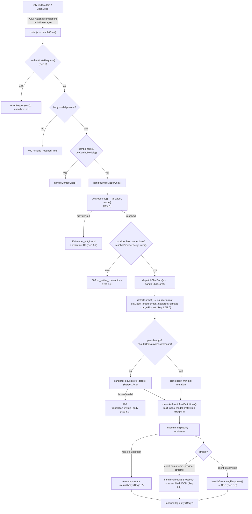
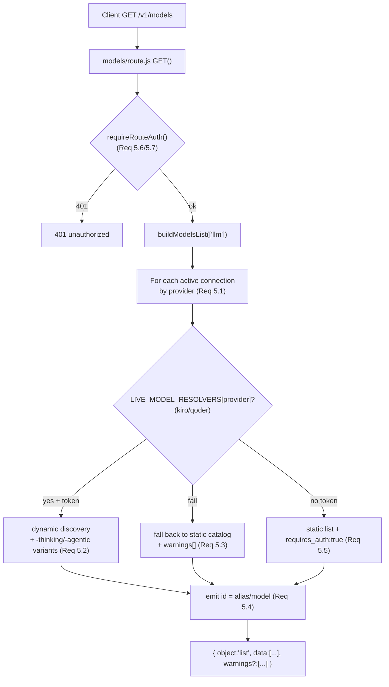
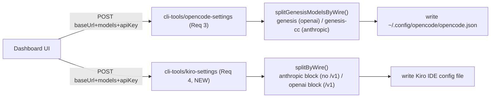

# Design Document

## Overview

This feature hardens the existing 9router-fork (genesis) inbound contract so that **Kiro IDE** and **OpenCode** clients can reach any configured upstream provider. The proxy already routes outbound to providers; the gaps are on the inbound edge:

- **"Not Found" (model resolution):** OpenCode/Kiro send `provider_alias/model_id` strings (e.g. `kr/claude-sonnet-4.6`). When a string is not a registered alias, combo, or `provider/model`, today the proxy returns a generic `400 validation_failed` from `handleSingleModelChat` (`src/sse/handlers/chat.js`). Requirement 1 sharpens this into precise `404` (unknown model, with available IDs) and `503` (zero connections) responses without inventing new resolution logic.
- **"Unauthorized" (auth):** `authenticateRequest` (`src/sse/services/auth.js`) already implements the fail-closed key rules from AGENTS.md, but the inbound contract for the three client-facing paths (`/v1/chat/completions`, `/v1/messages`, `/v1/models`) must be made uniform and explicitly tested (Requirement 2).
- **Wire-format mismatch:** Both `/v1/chat/completions` and `/v1/messages` funnel into `handleChat` → `handleChatCore`, which detects the source format and translates to the provider target format via `open-sse/translator`. Requirement 6 confirms and tests this cross-wire behavior (OpenAI-wire request → `cc/` Anthropic provider, and vice-versa), including the AGENTS.md built-in-tool `model`-prefix fix.
- **Config generation:** The OpenCode config-writer already exists at `src/app/api/cli-tools/opencode-settings/route.js`. Requirement 3 formalizes its wire-split behavior and validation. Requirement 4 adds a **new** Kiro IDE config-writer (no `cli-tools/kiro*` route exists today). Requirement 5 enumerates models via the existing `/v1/models` route (`buildModelsList`).
- **Logging:** Requirement 7 adds structured inbound diagnostics on top of the existing `ENABLE_REQUEST_LOGS` logger (`open-sse/utils/requestLogger.js`), reusing its redaction helpers.

**Design philosophy (from AGENTS.md):** fail closed for correctness/security (model resolution, auth, translation validity, stream-assembly integrity); fail open for optional side effects (request logging). Passthrough means passthrough — minimal mutation. The work is predominantly **extending existing code**, not greenfield; the only net-new surface is the Kiro IDE config-writer route and the structured inbound-log fields.

### Mapping to Requirements

| Requirement | Primary code touched | New vs. extend |
| --- | --- | --- |
| 1 — Model ID resolution | `src/sse/handlers/chat.js` (`handleSingleModelChat`), `src/sse/services/model.js` (`getModelInfo`), `src/sse/utils/providerRegistry.js` | Extend |
| 2 — Inbound auth | `src/sse/services/auth.js` (`authenticateRequest`), `src/sse/utils/routeAuth.js`, `v1/*/route.js` | Extend |
| 3 — OpenCode config | `src/app/api/cli-tools/opencode-settings/route.js` | Extend |
| 4 — Kiro IDE config | `src/app/api/cli-tools/kiro-settings/route.js` | **New** |
| 5 — Model enumeration | `src/app/api/v1/models/route.js` (`buildModelsList`) | Extend |
| 6 — Wire translation | `open-sse/handlers/chatCore.js`, `open-sse/translator/*`, `open-sse/translator/helpers/claudeHelper.js` | Extend |
| 7 — Inbound logging | `open-sse/utils/requestLogger.js`, `src/sse/handlers/chat.js` | Extend |

## Architecture

### Inbound request lifecycle (chat/completions and messages)

Both `POST /v1/chat/completions` (`src/app/api/v1/chat/completions/route.js`) and `POST /v1/messages` (`src/app/api/v1/messages/route.js`) call the same `handleChat(request)` in `src/sse/handlers/chat.js`. The route only differs by the URL path, which `handleChat` records as `clientRawRequest.endpoint` and which `handleChatCore` uses for source-format detection (`detectFormatByEndpoint`).



### Model enumeration lifecycle (`GET /v1/models`)



### Config generation lifecycle (OpenCode + Kiro IDE)



### Wire-type classification (single source of truth)

The OpenCode writer already classifies a model id as Anthropic-wire with the regex `/^(cc\/|claude[-/])/i` (`isClaudeWireModel` in `opencode-settings/route.js`). Requirement 4 broadens the Claude-compatible prefix set for Kiro (`cc/`, `kr/`, `kimi/`, `glm/`, `minimax/`). To avoid two divergent definitions, the design introduces a shared helper module:

- **`open-sse/config/wireType.js` (new):** exports `getWireType(providerModelString)` returning `"anthropic" | "openai"` and the prefix sets it uses. The OpenCode writer's local `isClaudeWireModel` is refactored to delegate here (surgical: same regex, no behavior change for existing OpenCode tests), and the new Kiro writer imports the same helper.

This is the only shared abstraction added; it exists because Requirements 3 and 4 must agree on wire classification, and AGENTS.md forbids duplicated divergent rules.

## Components and Interfaces

### 1. Inbound authentication — `authenticateRequest(request, log)` (Req 2)

Located in `src/sse/services/auth.js`; already invoked by both `handleChat` (chat/messages) and `requireRouteAuth` (`/v1/models`). No new entry point is needed; the contract is being tightened and tested.

**Current behavior (verified in source):**
- Reads settings via the strict `getSettings()`; on DB failure it falls back to safe defaults **with `requireApiKey:true`** (fail closed).
- `hasGenesisCredentialAttempt(request)` decides whether an `Authorization`/credential header is present.
- If a credential header is present, candidates are validated; **any invalid/malformed key returns `401` regardless of `requireApiKey`** (matches Req 2.3 and 2.6).
- If no credential header and `requireApiKey===true` → `401` (Req 2.2).
- If no credential header and `requireApiKey===false` → bypass is allowed only for verifiable loopback; bypass is logged (Req 2.4).
- A valid non-revoked key is accepted under both settings (Req 2.1, 2.5).

**Interface (unchanged signature):**

```js
// returns one of:
//   { ok: true, apiKey, settings, ... }              // proceed to resolution
//   { ok: false, response: Response(401) }            // unauthorized
async function authenticateRequest(request, log)
```

**Change required:** uniform application across all three paths (Req 2.7). `/v1/chat/completions` and `/v1/messages` already share `handleChat`; `/v1/models` uses `requireRouteAuth` which wraps the same `authenticateRequest`. The design keeps this single shared implementation and adds tests asserting identical behavior per path. The `401` body uses the existing `errorResponse(HTTP_STATUS.UNAUTHORIZED, ...)` whose `buildErrorBody` emits `type: "invalid_request_error"`; Req 2 calls for error **type** `unauthorized`. Surgical change: pass `{ errorType: "unauthorized" }` to `errorResponse` for these auth rejections so the wire error type matches the requirement, without altering status codes.

### 2. Model ID resolution — `getModelInfo()` + `handleSingleModelChat()` (Req 1)

`getModelInfo(modelStr)` (`src/sse/services/model.js`) wraps the core `parseModel` (`open-sse/services/model.js`). For a `provider_alias/model_id` string it splits on the first `/`, resolves the alias through `ALIAS_TO_PROVIDER_ID` (which already contains `cc`, `kr`, `cx`, `gc`, `gh`, `if`, `cu`, `kmc`, `openai`, `anthropic`, `gemini`, etc.), then verifies the provider via `isRegisteredProviderId`. On any failure it returns `{ provider: null }` — fail closed, never guess (AGENTS.md).

**Current gap:** `handleSingleModelChat` maps an unresolved model to `validationErrorResponse(VALIDATION_FAILED)` → HTTP `400`, and zero-connections to `noActiveCredentialsResponse(provider)`. Requirement 1 demands:
- **404** with `{ error: { type: "model_not_found", model: <unresolved>, available_models: [...] } }` when resolution fails (Req 1.2).
- **503** with `{ error: { type: "no_active_connections", provider: <alias> } }` when the provider has zero connections (Req 1.3).

**Interface change (surgical):**

```js
// new helper in open-sse/utils/error.js
export function modelNotFoundResponse(modelStr, availableModelIds)   // 404, type: model_not_found
export function noConnectionsResponse(providerAlias)                  // 503, type: no_active_connections
```

`handleSingleModelChat` is changed at two existing decision points:
1. `if (!modelInfo.provider)` → return `modelNotFoundResponse(modelStr, await listRegisteredModelIds())` instead of the current `400`.
2. The existing `if (!isNoAuthProvider && maxRetries === 0)` branch (which already detects zero connections via `resolveProviderRetryLimits`) → return `noConnectionsResponse(alias)` (`503`) instead of `noActiveCredentialsResponse`.

`listRegisteredModelIds()` is built from `buildModelsList(['llm'])` (the same function `/v1/models` uses) so the "available models" list is consistent across resolution errors and enumeration. Wire-type routing (Req 1.5/1.6) requires **no new code**: `handleChatCore` already computes `targetFormat` from `getModelTargetFormat(alias, model)` (per-model `targetFormat`) falling back to `getTargetFormat(provider)`, and `translateRequest` converts the source wire to that target. Upstream non-2xx passthrough (Req 1.7) is already preserved by the executor/`markAccountUnavailable` path, which returns the upstream status/body rather than reclassifying as a resolution failure.

### 3. Wire-format translation (Req 6)

`handleChatCore` (`open-sse/handlers/chatCore.js`) is the integration point. Verified flow:
- `sourceFormat = detectFormat(body, headers)` or `detectFormatByEndpoint(pathname, body)`.
- `targetFormat = getModelTargetFormat(alias, model) || getTargetFormat(provider)`.
- **Passthrough** (`shouldUseNativePassthrough`) clones the body with no schema translation; otherwise `translateRequest(sourceFormat, targetFormat, ...)` runs.
- A thrown translation error or falsy/non-object result → `createErrorResult(400, ..., { errorType: translation_invalid_body })` (Req 6.3). The proxy never forwards the invalid body upstream.
- Built-in Anthropic tool `model` prefixes are stripped by `cleanAnthropicToolDefinitions(tools, provider, ...)` in `claudeHelper.js` — the AGENTS.md fix (`normalizeAnthropicBuiltinToolModel` slices at `model.indexOf("/")+1`; client tools strip `model`+`type`, built-in tools preserve props but strip prefix). This is the only tool mutation allowed in passthrough (Req 6.4).
- Streaming (Req 6.5): `handleStreamingResponse` re-serializes upstream SSE into the inbound wire's stream format; a re-serialization failure terminates the stream with an error event.
- Forced assembly (Req 6.6): when the client did not request streaming but the provider always streams (`providerRequiresStreaming` for `openai`/`codex`/`commandcode`), `handleForcedSSEToJson` assembles the full SSE into one JSON body. On assembly failure it discards partial data and returns a proxy-internal error. **Note:** the existing code emits error code `sse_assembly_failed` (`PROXY_INTERNAL_ERROR_CODES.SSE_ASSEMBLY_FAILED`) with HTTP `502`. Requirement 6.6 names this `stream_assembly_failed`; the design keeps the existing `502` status and exposes `stream_assembly_failed` as the client-facing `error.type` alias for the same condition (one concept, consistent status).

No translation runs in passthrough mode except the required compatibility fixes — consistent with the AGENTS.md passthrough rules.

### 4. Model enumeration — `buildModelsList()` + `GET /v1/models` (Req 5)

`src/app/api/v1/models/route.js` already:
- Requires auth via `requireRouteAuth` (Req 5.6/5.7).
- Iterates active connections per provider (`activeConnectionByProvider`) (Req 5.1).
- Has a `LIVE_MODEL_RESOLVERS` map for `kiro` and `qoder` that calls `resolveKiroModels`/`resolveQoderModels` and overrides the static catalog on success, falling back to `rawModelIds` on failure (Req 5.2/5.3 foundation).
- Emits each model `id` as `${outputAlias}/${modelId}` (Req 5.4).

**Changes required (extend):**
- **Req 5.2 variants:** for Claude-family aliases (`cc`, `kr`, `kimi`, `glm`, `minimax`), after dynamic discovery, also emit `${id}-thinking` and `${id}-agentic` model entries. Add this expansion in the per-provider loop, gated by the shared `getWireType()==="anthropic"` plus family membership.
- **Req 5.3 warnings:** the current `LIVE_MODEL_RESOLVERS` `catch` only `console.log`s. Add a top-level `warnings` array threaded through `buildModelsList` so a dynamic-discovery failure pushes `{ provider, reason }` and still includes the static catalog. The `GET` response becomes `{ object: "list", data, warnings }` (omit `warnings` when empty to preserve the existing OpenAI-compatible shape for the happy path).
- **Req 5.5 `requires_auth`:** when a connection entry exists but has no active access token, tag each of that provider's static model objects with `requires_auth: true`. This is detected from the connection record (no token / `testStatus`), added where models are pushed.

**Interface:**

```js
// extended return contract
export async function buildModelsList(kindFilter)
// → { models: Array<{id, object, owned_by, requires_auth?}>, warnings: Array<{provider, reason}> }
// GET wraps: { object: "list", data: models, ...(warnings.length ? { warnings } : {}) }
```

### 5. OpenCode config-writer (Req 3)

`src/app/api/cli-tools/opencode-settings/route.js` already implements the wire-split:
- `splitGenesisModelsByWire(models)` partitions by `isClaudeWireModel` (`/^(cc\/|claude[-/])/i`).
- `applyGenesisProviders()`:
  - OpenAI-only → single `genesis` block, `npm: "@ai-sdk/openai-compatible"`, `baseURL: ${host}/v1` (Req 3.2).
  - Anthropic-only → single `genesis` block, `npm: "@ai-sdk/anthropic"`, `baseURL: ${host}` (no `/v1`) (Req 3.3).
  - Mixed → `genesis` (openai) + `genesis-cc` (anthropic), same `apiKey` (Req 3.4).
- Top-level `model` is prefixed by `providerPrefixForModel(firstModel, modelIds)` → `genesis/` or `genesis-cc/` matching the first model's wire (Req 3.5).
- `GET` returns `diagnostics` via `diagnoseGenesisOpenCodeConfig` (Req 3.6).
- `PATCH { repairClaudeWire: true }` runs `repairGenesisProviderSplit` (Req 3.7).

**Changes required (extend, surgical):**
- **Req 3.1/3.8 validation:** the current `POST` only checks `baseUrl && modelsArray.length`. Add explicit validation: `baseUrl` must be HTTP/HTTPS with **no trailing slash**, `models` non-empty array of strings, `apiKey` present and non-empty. On failure return `400` with `{ error: { fields: [...] } }` and **do not write** the file.
- **Req 3.6 GET-not-exist shape:** return `{ diagnostics: { fileExists: false, misconfigured: false } }` when the file is absent (today it returns an `installed/config` shape). Keep the richer fields additively; the required keys must be present.
- **Req 3.7 PATCH-not-exist:** return `404` when the file does not exist (today it returns `{ success: true, message: "No config file found" }`). Change that branch to `404`.
- Delegate `isClaudeWireModel` to the shared `getWireType()` helper (no regex change).

### 6. Kiro IDE config-writer (Req 4) — NEW

No `cli-tools/kiro*` route exists. Add `src/app/api/cli-tools/kiro-settings/route.js`, modeled on the OpenCode writer and the existing `cli-tools/*-settings` conventions (`requireSpawnRouteAuth`, `getCliHomeDir()`, `fs/promises`).

- **Claude-compatible prefixes** (`cc/`, `kr/`, `kimi/`, `glm/`, `minimax/`): Anthropic-compatible provider block, `baseURL: ${host}` (no `/v1`) (Req 4.2).
- **OpenAI-compatible prefixes** (`cx/`, `gc/`, `gh/`, `openai/`, `deepseek/`): OpenAI-compatible provider block, `baseURL: ${host}/v1` (Req 4.3).
- **Mixed**: separate blocks per wire, same `apiKey` (Req 4.4).
- **POST validation** (Req 4.1/4.5): valid HTTP/HTTPS `baseUrl`, non-empty `models`, non-empty `apiKey`, else `400` with offending fields and no write.
- **GET** (Req 4.6): `{ exists: false }` when absent; `{ exists: true, wireType: "anthropic"|"openai"|"mixed" }` when a genesis block is present.

The exact Kiro config file path and provider-block schema are the one open question (see Error Handling → Open Questions); the writer's wire-split logic and validation are fully specified above and shared with OpenCode via `getWireType()`.

### 7. Inbound request logging (Req 7)

`ENABLE_REQUEST_LOGS` gates `createRequestLogger(sourceFormat, targetFormat, model, { passthrough })` (`open-sse/utils/requestLogger.js`), which is already created in `handleChatCore`. It returns a no-op logger when logging is disabled and routes every field through `redactSensitiveText` / `maskSensitiveHeaders` / `sanitizeLogValue` (`src/shared/utils/redaction.js`) — satisfying Req 7.5 redaction.

**Change required (extend):** add a single structured inbound summary entry written on completion (success or error) containing exactly the Req 7.1 fields: `{ inboundWire, rawModel, resolvedProviderModelString | null, status }`. Because auth and resolution happen in `handleChat`/`handleSingleModelChat` (before `handleChatCore` builds its logger), the summary is emitted from `handleChat` via a small helper `logInboundSummary(fields)` that:
- writes via the same session logger when available, otherwise a lightweight `appendRequestLog`-style sink;
- on resolution failure includes `unresolvedModel` + the full registered `Provider_Model_String` set (Req 7.2);
- on auth failure includes `reason ∈ { missing_header, invalid_key, malformed_header }` and **never** the key or raw `Authorization` value (Req 7.3);
- is wrapped so any logging error is swallowed and the request proceeds (Req 7.4 — fail open, per AGENTS.md "optional systems must not break the request path").

**Interface:**

```js
// open-sse/utils/requestLogger.js (new export)
export function logInboundSummary({ inboundWire, rawModel, resolvedModel, status, authFailureReason, unresolvedModel, registeredModels }) // never throws
```

## Data Models

### Provider_Model_String

```
Provider_Model_String := alias "/" model_id
alias                  ∈ keys(ALIAS_TO_PROVIDER_ID)   // cc, kr, cx, gc, gh, if, cu, kmc, openai, anthropic, gemini, ...
model_id               := non-empty string (may itself contain "/")
```
Parsed by `parseModel` splitting on the **first** `/`. Lookup is case-sensitive, exact-match on the full string (Req 1.4).

### Wire_Type

```ts
type WireType = "anthropic" | "openai";
// getWireType(pms): "anthropic" if /^(cc\/|kr\/|kimi\/|glm\/|minimax\/|claude[-/])/i else "openai"
//   (OpenCode Req 3 uses the narrower cc/ + claude prefix; Kiro Req 4 adds kr/kimi/glm/minimax.
//    The shared helper accepts a `family` arg to select the prefix set per caller.)
```

### Inbound resolution result

```ts
type ModelInfo =
  | { provider: string; model: string }   // resolved
  | { provider: null; model: string };    // resolution failed → 404 (chat) / excluded (models)
```

### Error response bodies (OpenAI-compatible envelope)

```jsonc
// 404 — unresolved model (Req 1.2)
{ "error": { "type": "model_not_found", "message": "...", "model": "zz/nope",
             "available_models": ["cc/claude-opus-4-8", "kr/claude-sonnet-4.6", ...] } }

// 503 — provider has zero connections (Req 1.3)
{ "error": { "type": "no_active_connections", "message": "...", "provider": "kr" } }

// 401 — auth (Req 2)
{ "error": { "type": "unauthorized", "message": "..." } }

// 400 — translation failure (Req 6.3)
{ "error": { "type": "translation_invalid_body", "message": "<validation detail>" } }

// 502 — forced SSE→JSON assembly failure (Req 6.6; internal code sse_assembly_failed)
{ "error": { "type": "stream_assembly_failed", "message": "..." } }

// 400 — config-writer validation (Req 3.8 / 4.5)
{ "error": { "message": "...", "fields": ["baseUrl", "apiKey"] } }
```

### `/v1/models` response (Req 5)

```jsonc
{
  "object": "list",
  "data": [
    { "id": "kr/claude-sonnet-4.6",          "object": "model", "owned_by": "kr" },
    { "id": "kr/claude-sonnet-4.6-thinking",  "object": "model", "owned_by": "kr" },   // Req 5.2
    { "id": "kr/claude-sonnet-4.6-agentic",   "object": "model", "owned_by": "kr" },   // Req 5.2
    { "id": "openai/gpt-5.4", "object": "model", "owned_by": "openai", "requires_auth": true } // Req 5.5
  ],
  "warnings": [ { "provider": "kiro", "reason": "ListAvailableModels timeout" } ]      // Req 5.3 (omitted when empty)
}
```

### OpenCode `opencode.json` (Req 3, existing shape)

```jsonc
{
  "provider": {
    "genesis":    { "npm": "@ai-sdk/openai-compatible", "options": { "baseURL": "http://127.0.0.1:20128/v1", "apiKey": "sk_genesis" }, "models": { "cx/gpt-5.4": { "name": "cx/gpt-5.4", "modalities": {...} } } },
    "genesis-cc": { "npm": "@ai-sdk/anthropic",         "options": { "baseURL": "http://127.0.0.1:20128",     "apiKey": "sk_genesis" }, "models": { "cc/claude-opus-4-8": {...} } }
  },
  "model": "genesis/cx/gpt-5.4"   // prefix matches first model's wire (Req 3.5)
}
```

### Kiro IDE config (Req 4, NEW — schema TBD, wire-split fixed)

```jsonc
// anthropic-wire block: baseURL = {baseUrl}        (no /v1)
// openai-wire block:    baseURL = {baseUrl}/v1
// mixed: both blocks, same apiKey
```

### Inbound log entry (Req 7.1, redacted)

```jsonc
{ "inboundWire": "openai", "rawModel": "kr/claude-sonnet-4.6",
  "resolvedProviderModelString": "kr/claude-sonnet-4.6", "status": 200,
  "authFailureReason": null, "Authorization": "[REDACTED]" }
```

## Correctness Properties

*A property is a characteristic or behavior that should hold true across all valid executions of a system — essentially, a formal statement about what the system should do. Properties serve as the bridge between human-readable specifications and machine-verifiable correctness guarantees.*

After prework, redundant criteria were consolidated: 2.5/2.6 fold into the auth properties below; 5.6/5.7 fold into the path-invariance property (P6); 1.5/1.6 combine into one wire-routing property (P3); the three per-writer wire-block criteria (3.2/3.3/3.4 and 4.2/4.3/4.4) each combine into one "wire-block assignment is correct for any model mix" property (P12, P15).

### Property 1: Registered model strings resolve to their mapped provider

*For any* registered alias `a` (a key of `ALIAS_TO_PROVIDER_ID`) and any non-empty `model_id`, `getModelInfo(`a/model_id`)` returns `{ provider: ALIAS_TO_PROVIDER_ID[a], model: model_id }` and the request is forwarded upstream.

**Validates: Requirements 1.1**

### Property 2: Unknown model strings fail closed with 404 and the available list

*For any* string whose prefix is not a registered alias, combo name, or provider-node prefix, resolution returns no provider and the response is HTTP `404` with `error.type = "model_not_found"`, `error.model` equal to the input string, and `error.available_models` equal to the current registered model-id list.

**Validates: Requirements 1.2**

### Property 3: Wire-type determines the translation path independent of inbound endpoint

*For any* resolved `Provider_Model_String`, the computed `targetFormat` equals `"claude"` when the provider/model is Anthropic-wire and `"openai"` when it is OpenAI-wire, regardless of whether the request arrived on `/v1/chat/completions` or `/v1/messages`.

**Validates: Requirements 1.5, 1.6**

### Property 4: Resolution lookup is case-sensitive and exact

*For any* registered alias `a`, mutating the case of `a` (where the mutation differs from `a`) causes resolution to fail, while the exact `a/model_id` resolves successfully.

**Validates: Requirements 1.4**

### Property 5: Provider with zero connections fails closed with 503

*For any* registered provider that has zero configured connections, an inbound request resolving to that provider returns HTTP `503` with `error.type = "no_active_connections"` and `error.provider` equal to the provider alias.

**Validates: Requirements 1.3**

### Property 6: Authentication decision is uniform across all inbound paths

*For any* combination of `Authorization` header value and `requireApiKey` setting, `authenticateRequest` yields the same accept/reject decision and the same HTTP status on each of `/v1/chat/completions`, `/v1/messages`, and `/v1/models`.

**Validates: Requirements 2.7, 5.6, 5.7**

### Property 7: Valid keys are accepted under both settings

*For any* stored non-revoked API key, a request bearing `Authorization: Bearer {key}` is accepted whether `requireApiKey` is `true` or `false`.

**Validates: Requirements 2.1, 2.5**

### Property 8: Invalid or malformed credentials are always rejected

*For any* malformed `Authorization` header or any bearer token that does not match a stored non-revoked key, the response is HTTP `401` with `error.type = "unauthorized"`, regardless of the `requireApiKey` setting.

**Validates: Requirements 2.3, 2.6**

### Property 9: Upstream non-2xx is surfaced verbatim, not reclassified

*For any* upstream non-2xx status and body returned after a successfully resolved and forwarded request, the client receives that same status and body, and the error is not reported as a model-resolution failure.

**Validates: Requirements 1.7**

### Property 10: Cross-wire translation produces a valid target body that leaks no source-only fields

*For any* OpenAI-format request body routed to an Anthropic-wire provider (and symmetrically, any Anthropic-format body routed to an OpenAI-wire provider), the translated body validates against the target wire schema and contains no field exclusive to the source wire.

**Validates: Requirements 6.1, 6.2**

### Property 11: Schema-invalid translation fails closed without forwarding

*For any* request whose translation produces a body that fails target-format schema validation, the response is HTTP `400` with `error.type = "translation_invalid_body"` and no request is forwarded upstream.

**Validates: Requirements 6.3**

### Property 12: Same-wire passthrough mutates only the built-in-tool model prefix

*For any* request whose inbound wire already matches the target provider wire, the forwarded body is byte-identical to the input except that provider prefixes are stripped from Anthropic built-in tool `model` fields; no other field is added, removed, or renamed.

**Validates: Requirements 6.4**

### Property 13: Streaming responses are re-serialized into the inbound wire format

*For any* upstream SSE event sequence streamed to a `stream: true` client, every emitted event is well-formed in the inbound wire's streaming format; if re-serialization of any event fails, the stream terminates with an error event and emits no further data events.

**Validates: Requirements 6.5**

### Property 14: Forced SSE→JSON assembly yields complete JSON or fails closed

*For any* complete upstream SSE stream delivered to a non-streaming client, the assembled response is a single valid JSON document in the inbound wire format; *for any* truncated or malformed SSE stream, the response is HTTP `502` (`error.type = "stream_assembly_failed"`) with no partial JSON returned.

**Validates: Requirements 6.6**

### Property 15: Config writers assign each model to the correct wire block

*For any* non-empty set of `Provider_Model_String` values submitted to the OpenCode writer or the Kiro writer, each model is placed in the block matching its `Wire_Type` (Anthropic-wire → `@ai-sdk/anthropic` block with `baseURL = {baseUrl}` and no `/v1`; OpenAI-wire → OpenAI-compatible block with `baseURL = {baseUrl}/v1`), all blocks share the same `apiKey`, and the written config contains a `providers`/`provider` object plus a `model` field.

**Validates: Requirements 3.1, 3.2, 3.3, 3.4, 4.1, 4.2, 4.3, 4.4**

### Property 16: The active model prefix matches the first model's wire type

*For any* non-empty model array submitted to the OpenCode writer, the top-level `model` field is prefixed by the provider key (`genesis/` or `genesis-cc/`) whose `Wire_Type` matches the first model in the array.

**Validates: Requirements 3.5**

### Property 17: Invalid config-writer input fails closed with field-level 400 and no write

*For any* config-writer POST input that has a missing or non-HTTP/HTTPS `baseUrl`, an empty `models` array, or an absent `apiKey`, the response is HTTP `400` identifying the invalid field(s) and no configuration file is written.

**Validates: Requirements 3.8, 4.5**

### Property 18: Wire repair preserves the full model set

*For any* existing OpenCode config containing genesis model entries, applying `repairClaudeWire` produces a config whose set of model ids equals the original set (no entry removed) and in which every model resides in the block matching its `Wire_Type`.

**Validates: Requirements 3.7**

### Property 19: Misconfiguration diagnosis is correct over arbitrary configs

*For any* OpenCode config, the GET diagnostics report `misconfigured: true` exactly when an Anthropic-wire model resides in a block using `@ai-sdk/openai-compatible` or whose `baseURL` ends in `/v1`, and report the corresponding `expectedNpm`/`expectedBaseURL`.

**Validates: Requirements 3.6**

### Property 20: Config GET reports wire type consistent with stored models

*For any* present Kiro config, the GET response `wireType` equals `"anthropic"` when all models are Claude-compatible, `"openai"` when all are OpenAI-compatible, and `"mixed"` otherwise.

**Validates: Requirements 4.6**

### Property 21: Model enumeration includes every connected provider

*For any* set of active provider connections, `/v1/models` includes at least one model entry for every provider that has at least one connection, regardless of token validity.

**Validates: Requirements 5.1**

### Property 22: Claude-family discovery includes thinking and agentic variants

*For any* dynamically discovered Claude-family model (aliases `cc`, `kr`, `kimi`, `glm`, `minimax`), the `/v1/models` list contains the base id and its `-thinking` and `-agentic` variants.

**Validates: Requirements 5.2**

### Property 23: Discovery failure falls back to the static catalog with a warning

*For any* provider whose dynamic model discovery fails, the response still includes that provider's static model catalog and a `warnings` entry naming the provider and the failure reason; the provider's models are never omitted.

**Validates: Requirements 5.3**

### Property 24: Every enumerated model id is a full Provider_Model_String

*For any* model returned by `/v1/models`, its `id` is of the form `{alias}/{model_id}` matching its `owned_by` alias.

**Validates: Requirements 5.4**

### Property 25: Tokenless connections expose static models flagged requires_auth

*For any* connection entry that has no active access token, every model contributed by that provider appears in `/v1/models` with `requires_auth: true`.

**Validates: Requirements 5.5**

### Property 26: Completed requests are logged with the required fields

*For any* completed inbound request (success or error) when `ENABLE_REQUEST_LOGS=true`, the log entry contains the inbound wire type, the raw `model` field, the resolved `Provider_Model_String` (or `null` when resolution failed), and the response HTTP status; the resolved field is `null` exactly when resolution failed.

**Validates: Requirements 7.1**

### Property 27: Resolution-failure logs include the unresolved string and the registry set

*For any* request that fails model resolution under logging, the log entry contains the unresolved model string and the full set of registered `Provider_Model_String` values available at failure time.

**Validates: Requirements 7.2**

### Property 28: Auth-failure logs classify the reason without leaking credentials

*For any* request that fails authentication under logging, the log entry's failure reason is one of `missing_header`, `invalid_key`, or `malformed_header`, and the serialized entry contains neither the key value nor the raw `Authorization` header value.

**Validates: Requirements 7.3**

### Property 29: Logging never breaks the request path

*For any* failure of the log sink, the client response is identical to the response produced with logging disabled, and request processing completes.

**Validates: Requirements 7.4**

### Property 30: Secrets are redacted before serialization

*For any* log entry containing an `Authorization` header value, an upstream API key field, or a bearer token string, the serialized entry replaces each with the literal `[REDACTED]` and contains no occurrence of the original secret.

**Validates: Requirements 7.5**

## Error Handling

Per AGENTS.md: **fail closed** for correctness/security; **fail open** for optional side effects.

| Condition | Status | `error.type` | Source / handler |
| --- | --- | --- | --- |
| Missing `model` field | 400 | `missing_required_field` | `handleChat` (existing) |
| Unresolved model string | 404 | `model_not_found` | `modelNotFoundResponse` (new) — Req 1.2 |
| Provider has zero connections | 503 | `no_active_connections` | `noConnectionsResponse` (new) — Req 1.3 |
| Missing/invalid/malformed credentials | 401 | `unauthorized` | `authenticateRequest` → `errorResponse(401, {errorType:"unauthorized"})` — Req 2 |
| Translation throws / invalid body | 400 | `translation_invalid_body` | `handleChatCore` (existing) — Req 6.3 |
| Forced SSE→JSON assembly fails | 502 | `stream_assembly_failed` (internal `sse_assembly_failed`) | `handleForcedSSEToJson` (existing) — Req 6.6 |
| Streaming re-serialize fails | — | terminal SSE error event | `handleStreamingResponse` (existing) — Req 6.5 |
| Upstream non-2xx | upstream status | upstream body | executor path (existing) — Req 1.7 |
| Config POST invalid fields | 400 | field list in body | config-writer (extend) — Req 3.8/4.5 |
| Config PATCH repair, file absent | 404 | — | opencode-settings PATCH (extend) — Req 3.7 |
| Models DB unavailable | 503 | `service_unavailable` | `buildModelsList`/`ModelsDbError` (existing) |

**Fail-open paths (must never break the request):**
- Request logging (Req 7.4): every `logInboundSummary` / session-logger write is wrapped (the existing `safeWrite` pattern already swallows logger errors). If logging fails — and even if logging the failure fails — the request proceeds.
- Compression/stats (RTK, Headroom, Caveman) are already fail-open in `handleChatCore` and are out of scope for this feature.

**Fail-closed correctness guards reused as-is:** cache-integrity verification (`assertCacheIntegrity`), zero-connection → zero-retry (`resolveProviderRetryLimits`), and "combo-name match alone is not success" (`getModelInfo`/`getComboModels`).

### Open Questions — RESOLVED (decisions of record)

> Both questions were investigated against the live codebase and Kiro's published docs during Task 1. Decisions below are binding for the dependent tasks (11 and 8.2).

#### Decision 1 — Kiro IDE config file path and provider-block schema (Req 4). Blocks Task 11.

**Investigation.**
- `getCliHomeDir()` (`src/shared/utils/cliHome.js`) returns `CLI_HOME`/`NINE_ROUTER_CLI_HOME` if set, else `os.homedir()`. Every existing `cli-tools/*-settings` route composes its own path under it (e.g. OpenCode → `~/.config/opencode/opencode.json`, Claude → `~/.claude/settings.json`, Codex → `~/.codex/config.toml`). No `cli-tools/kiro*` route or fixture exists in the repo (`grep` over `src/app/api/cli-tools/**` returned no `kiro` match).
- Kiro's own docs: the CLI home is `~/.kiro` (overridable via the `KIRO_HOME` env var). Settings are managed by `kiro-cli settings` and stored at `~/.kiro/settings/cli.json`; MCP config at `~/.kiro/settings/mcp.json`. The **documented** settings surface (`chat.defaultModel`, `chat.defaultAgent`, agents, MCP, telemetry, etc.) has **no** native "OpenAI/Anthropic-compatible provider block" with a custom `baseURL` + `apiKey`.
- Custom OpenAI/Anthropic-compatible base URL + key is an **open, unshipped feature request** for Kiro (GitHub `kirodotdev/Kiro` issues #3115 and #1067). Existing third-party integrations (e.g. `jwadow/kiro-openai-gateway`) work by proxying upstream, not by writing a native Kiro provider-config file. **There is therefore no authoritative provider-block schema to confirm.**

**Decision.**
- **Path:** `~/.kiro/settings/genesis-providers.json` under `getCliHomeDir()` — i.e. `path.join(getCliHomeDir(), ".kiro", "settings", "genesis-providers.json")`. Rationale: `~/.kiro/settings/` is Kiro's documented settings directory; a dedicated `genesis-providers.json` keeps our generated provider blocks isolated from Kiro-managed files (`cli.json`, `mcp.json`) so we never clobber settings Kiro validates itself. **Do not** write into `cli.json` or `mcp.json`.
  - Honor `KIRO_HOME` if present: if `process.env.KIRO_HOME` is set, the `.kiro` segment resolves from it; otherwise from `getCliHomeDir()`. Mirror the existing per-route path-helper pattern (a `getKiroSettingsDir()` / `getKiroConfigPath()` pair).
- **Schema (mirror OpenCode, per the Task 1 fallback directive):** provider blocks keyed by name with `options.baseURL` / `options.apiKey`:
  ```jsonc
  {
    "provider": {
      "genesis":    { "type": "openai",    "options": { "baseURL": "{baseUrl}/v1", "apiKey": "{apiKey}" }, "models": { "cx/gpt-5.4": {} } },
      "genesis-cc": { "type": "anthropic", "options": { "baseURL": "{baseUrl}",     "apiKey": "{apiKey}" }, "models": { "cc/claude-opus-4-8": {} } }
    }
  }
  ```
  - Anthropic-wire block → `baseURL = {baseUrl}` (no `/v1`); OpenAI-wire block → `baseURL = {baseUrl}/v1`; mixed → both blocks, same `apiKey` (Req 4.2/4.3/4.4).
  - Block key naming reuses OpenCode's `genesis` (openai) / `genesis-cc` (anthropic) convention so GET wire-type detection (Req 4.6) shares logic. The `type` discriminator (`"openai"` | `"anthropic"`) records the wire so a single block is unambiguous; if a future confirmed Kiro schema needs a different discriminator (e.g. an `npm` package name like OpenCode), only the block-builder changes — wire-split, validation, and GET contract are unaffected.
- **Status:** This is a **provisional, isolated** schema chosen because Kiro has no shipped native provider-config contract. It is safe (fail-closed: we never touch Kiro-managed files) and fully testable. **Re-confirm and adjust the block field names** if/when Kiro ships official custom-provider support; the change is localized to the block-builder in `kiro-settings/route.js`.

#### Decision 2 — `stream_assembly_failed` vs `sse_assembly_failed` naming (Req 6.6). Blocks Task 8.2.

**Investigation.**
- Internal control flow keys off `error.code`, never the proxy-generated `error.type`: `isProxyInternalError({ errorCode })` (`open-sse/utils/error.js`) tests `errorCode` against `PROXY_INTERNAL_CODE_SET`, and `isProxyInternalResponse` (`open-sse/services/combo.js`) reads `body.error.code` to decide combo non-advancement; `checkFallbackError` (`accountFallback.js`) likewise uses `errorCode`. Renaming the constant `SSE_ASSEMBLY_FAILED` ("sse_assembly_failed") would ripple into combo/fallback gating and the Kiro executor (`open-sse/executors/kiro.js` emits `code: "sse_assembly_failed"` directly) and several tests (`combo-sequencing`, `round3-4-streaming-fixes`, `fallback-chatcore-correctness`, `open-sse-bug-fixes`) that assert `error.code === "sse_assembly_failed"`.
- The only readers of a proxy `error.type` are log lines (`parseSSEToClaudeResponse` / `parseSSEToOpenAIResponse` `console.warn` on **upstream** error frames). **No internal caller branches on `error.type === "stream_assembly_failed"`** — that string appears only in this spec.
- For a 502, `buildErrorBody` defaults `type: "server_error"` unless an explicit `errorType` is passed. Today `PROXY_INTERNAL_SSE` passes only `errorCode`, so the forced-assembly 502 currently has `type: "server_error"`, `code: "sse_assembly_failed"`.

**Decision — alias only at the response boundary (no rename).**
- Keep the internal constant `PROXY_INTERNAL_ERROR_CODES.SSE_ASSEMBLY_FAILED = "sse_assembly_failed"` and the `502` status unchanged. Combo/fallback gating and all existing `error.code` assertions continue to pass untouched.
- In `handleForcedSSEToJson` (Task 8.2), add `errorType: "stream_assembly_failed"` to the `createErrorResult(...)` options for the assembly-failure path so the client sees `error.type = "stream_assembly_failed"` while `error.code` stays `"sse_assembly_failed"`. This is the one concept, two fields: a client-facing `type` alias over the unchanged internal `code`.
- **Confirmed safe:** no other caller depends on the client-facing `error.type` for this condition; the alias is additive and does not alter status or internal classification.

## Testing Strategy

This feature is logic-heavy (resolution, wire classification, translation, config transforms, model-list construction, redaction) — all expressible as "for all inputs X, property P(X) holds" over pure or mockable functions. **Property-based testing applies** and is the primary strategy, complemented by example/integration/smoke tests for the parts that are infrastructure or one-shot.

### Dual approach

- **Property tests** — verify Properties 1–30. Library: **fast-check** with **vitest** (the repo already runs `vitest run --config tests/vitest.config.js` with 1300+ mostly-mocked tests). Do **not** hand-roll PBT. Minimum **100 iterations** per property. Each property test is tagged with a comment: `// Feature: multi-client-inbound-support, Property {n}: {property text}`.
- **Example/unit tests** — concrete cases that complement properties: no-Authorization-header `401` (Req 2.2), `requireApiKey=false` loopback bypass (Req 2.4), GET `fileExists:false` (Req 3.6), PATCH `404` when file absent (Req 3.7), Kiro GET `{exists:false}` (Req 4.6).
- **Integration tests (1–3 examples, not PBT)** — live model discovery against the real Kiro `ListAvailableModels` path is an external service; cover with a small integration test, not 100 iterations (the static-fallback *logic* is covered by Property 23 with a mocked thrower). End-to-end `/v1/models` happy path via the running server (see AGENTS.md hello-world flow) is one integration check.
- **Smoke test** — server starts and `GET /api/health` → `{"ok":true}` (AGENTS.md), confirming routes wire up.

### Property → test mapping (representative generators)

| Property | Generator | Oracle |
| --- | --- | --- |
| P1, P4 | alias ∈ `ALIAS_TO_PROVIDER_ID` keys × arbitrary model_id (+ case mutations) | mapped provider id / resolution failure |
| P2, P27 | strings with non-registered prefix | 404 body shape + registry set |
| P3, P10, P12 | bodies + anthropic/openai-wire models | targetFormat; target-schema validity; byte-diff = prefix strip only |
| P6, P7, P8 | (header value, requireApiKey) × {3 paths} | identical decision; accept; 401 |
| P11, P14 | translator-failing inputs / truncated SSE | 400 no-forward; 502 no-partial |
| P13 | arbitrary SSE event sequences (+ injected malformed) | well-formed re-serialization / terminal error |
| P15–P20 | arbitrary `Provider_Model_String` sets (openai/anthropic/mixed) | block assignment, model-set invariance, diagnostics |
| P21–P25 | arbitrary connection sets (with/without tokens; mocked discovery) | provider coverage; variants; warnings; id shape; requires_auth |
| P26, P28, P29, P30 | request outcomes; secrets embedded in fields; throwing log sink | log fields; reason ∈ set; response unchanged; `[REDACTED]`, no secret substring |

### Anthropic built-in tool fix (AGENTS.md)

Property 12 directly exercises the known fix in `open-sse/translator/helpers/claudeHelper.js` (`cleanAnthropicToolDefinitions` / `normalizeAnthropicBuiltinToolModel`): client tools strip `model`+`type`; built-in tools preserve properties but strip the provider prefix (`cc/…` → `…`). Dedicated unit assertions (from the AGENTS.md test list) accompany the property: prefixed built-in tool models must never reach Anthropic; passthrough applies the fix only when required to prevent rejection.

### Build / runtime verification (AGENTS.md — non-negotiable)

Because changes touch `open-sse/` and route code compiled by Next.js, **clear the webpack cache before every CLI rebuild**, otherwise behavior will not match source:

```bash
rm -rf .next-cli-build && (cd cli && npm run build)
```

After rebuild, verify the compiled bundle contains the built-in-tool fix (chunk names vary between builds):

```bash
grep -R "model.slice.*indexOf.*+1" cli/app/.next-cli-build/server/chunks
# or: bash scripts/verify-compiled-anthropic-fix.sh
```

Run the unit/property suite without a live server from repo root:

```bash
npm test            # vitest run --config tests/vitest.config.js
npm run lint:backend
```

For E2E `/v1/models` and inbound auth checks, run the server in production mode (`npm run dev` has a known `better-sqlite3` bundling issue) and use the AGENTS.md hello-world flow (`/api/health` → login → create key → `GET /v1/models` with `Authorization: Bearer <key>`). In headless/non-TTY environments launch via `node cli/app/server.js` after building, not the `genesis` CLI wrapper. Confirm the global install is a symlink to the fork before debugging runtime behavior.
